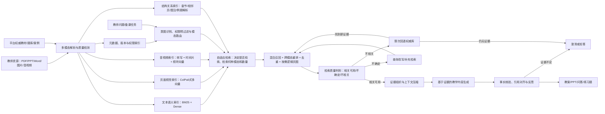

# 多模态RAG论文阅读：项目可用技术与创新点

## 1. 阅读范围与结论

本笔记基于项目论文库中的34份 PDF 整理，共约764页；其中 P28 是 P24 预印本的 ACL 2025 正式版，因此对应33项独立研究工作。新增精读覆盖：

- 多模态解析与向量化：CLIP、LayoutLMv3、Donut、Whisper、ImageBind、BLIP-2、ColPali；
- 语义检索与知识增强：RAG、DPR、ColBERT、HyDE、MuRAG、RA-CM3、MRAG综述、Lost in the Middle；
- 幻觉抑制与评测：Self-RAG、CRAG、CRITIC、结构化输出幻觉抑制、RAGAS、ARES、不可回答性评测；
- 前沿策略：多模态RAG综述、M2RAG、自适应多模态RAG、DRAGIN等；
- 2025正式论文：VDocRAG、VisDoM、GME、OMGM、MoLoRAG、ViDoRAG，以及 Ask in Any Modality 的 ACL 正式版本。

论文库位置：`C:\Users\12480\Desktop\服务外包\文献综述和研究思路\多模态RAG论文库`

总体判断：项目不宜只做“文档切片 + 向量数据库 + 大模型”的普通RAG。更有价值的技术路线是：

> 面向教师私有资源与平台权威资源，构建保留文档视觉结构和音视频时间结构的多模态知识库；根据问题动态选择文本、页面图像和音视频证据，执行混合召回、跨模态重排和检索纠错；生成时建立逐条事实与证据的对应关系，在证据不足时主动澄清或拒答。

Ask in Any Modality 的 ACL 2025 正式版本把现有工作归纳为检索、融合、增强、生成、训练和智能体六类，并将精确跨模态归因、统一嵌入、组合推理、知识投毒防御及成本可扩展性列为开放问题。[P28] 本项目的“双索引—动态路由—逻辑检索—声明核验”主线与这些问题一致，但各模块的有效性必须分别通过中文教学数据验证。

### 论文标注说明

- 正文中的`[P01]`至`[P34]`对应本笔记第7节“34份论文PDF与项目用途对照”。
- 一个判断后有多个编号，表示该方案是对多篇论文的综合，而非由单篇论文直接提出。
- “项目建议”属于在论文方法基础上结合本项目需求所做的工程推演；引用编号用于标明其技术来源，不代表原论文已经实现完整教学场景。

---

## 2. 建议的总体技术架构



---

## 3. 可直接用于项目的技术

### 3.1 多模态数据解析与向量化

#### 3.1.1 文档解析采用“双通道”，而不是只做OCR

建议为PDF、PPT、Word建立两个并行通道：

1. **结构化文本通道**
   - 提取标题、段落、列表、表格、公式、图片说明、页码和章节层级；
   - 使用OCR处理扫描页，保留文字坐标和页码；
   - 生成便于关键词检索和语义检索的文本块。

2. **页面视觉通道**
   - 将完整页面渲染为图像；
   - 直接生成页面级或图像块级多向量；
   - 保留图表、字体、空间关系和版面信息。

论文依据：

- LayoutLMv3将文本、图像和版面位置联合建模，说明教学文档中的空间结构具有语义价值。[P02]
- Donut指出传统OCR可能产生计算开销、语言适配困难和误差级联。[P03]
- ColPali直接嵌入文档页面图像，通过多向量后期交互完成检索，避免完全依赖脆弱的OCR流水线。[P07]

项目落地：

- 教材正文、教案段落走文本通道；
- 几何图、实验流程图、PPT信息图、复杂表格优先走视觉通道；
- 文本通道保留`resource_id/page/section/bbox`；视觉通道保留`page_id`及相关图像块或热力图。ColPali主要完成页面级检索，若需精确高亮，仍要结合OCR或版面分析模型定位。[P07]

新增论文进一步限定了双通道的适用边界：VDocRAG 在 ChartQA、SlideVQA、InfoVQA 和 DUDE 上显著优于同底座文本 RAG，但作者的人工错误分析显示，其主要增益来自图表等视觉内容，在书籍等长文本页面上会受视觉 OCR 能力限制。[P29] VisDoM 的多文档实验中，ColQwen2 在来源文档识别上平均达到 96.94%，高于 BGE-1.5 的 92.40%，但该方法仍保留 OCR 文本管线并需要三次 LLM 调用。[P30] 因此，本项目不应把“视觉 RAG”写成对文本 RAG 的全面替代，而应根据页面类型和任务动态分流。

#### 3.1.2 图片采用视觉-语言共享空间

CLIP证明可以使用对比学习把图像和自然语言映射到共享空间；ImageBind进一步将图像、文本、音频、深度、热成像和IMU六种模态绑定到统一空间。[P01][P05] BLIP-2则通过Q-Former连接冻结视觉编码器与语言模型，更适合图片描述和视觉问答，而非作为默认检索编码器。[P06]

项目可用方式：

- 教师用文字查询“串联电路示意图”，直接召回图片；
- 教师上传一张图，反向检索相似课件页、案例和讲解视频；
- 使用CLIP/ImageBind或ColPali生成检索向量，并可借助BLIP-2生成图片描述；
- 为图片保存“视觉向量 + 自动描述 + OCR文字”三类表示，提高召回稳定性；
- 图片描述只作为辅助索引，原图向量和原始证据不能被描述文本替代。

#### 3.1.3 音视频采用“转写 + 时间片 + 多模态向量”

Whisper表明大规模弱监督可以获得较强的多语种、跨噪声语音识别能力；ImageBind提供音频、图像与文本对齐思路，但不把视频作为独立模态。[P04][P05] 因此项目应把视频拆成关键帧、音轨、转写文本和时间戳进行联合索引。

建议流程：

1. 提取音轨并用Whisper生成带时间戳的转写；
2. 结合语音活动、句子边界、最大时长和主题变化切分；
3. 每个片段保存`segment_id/start_time/end_time/transcript/keyframes`，需要时增加说话人标签；
4. 转写进入文本索引，关键帧进入视觉索引；音频向量主要用于检索非语言声音，语音内容优先依赖转写；
5. 检索结果直接跳转到视频对应时间点。

#### 3.1.4 教学语义分块

普通固定长度切片容易割裂“教学目标—知识点—例题—答案—解析”的关系。多模态RAG综述也将数据预处理、分块和跨模态组织视为索引阶段的重要环节。[P14][P24] 建议采用教学结构感知分块：

- 教材：章—节—知识点—例题—习题；
- 教案：教学目标—重点难点—教学过程—课堂活动—评价；
- PPT：页—标题—正文—图表—备注；
- 视频：主题片段—讲解—演示—提问—总结。

同时建立父子块：小块用于精准召回，父块用于补足上下文。

#### 3.1.5 统一多模态嵌入器作为第二阶段候选

GME 使用同一个 MLLM 编码文本、自然图像、视觉文档和图文混合输入，通过指令化对比学习、难负例挖掘和多种模态均衡训练形成统一嵌入空间。[P31] 其 7B 模型在 47 个数据集组成的 UMRB 上平均得分为 67.44，文本到视觉文档任务 nDCG@5 为 89.92，说明“一个检索器覆盖多种查询/候选模态”具有可行性。

项目中建议把 GME 定位为**第二阶段实验方案**，而不是直接替换 MVP 的多路召回：

- 对比“BM25 + 中文 Dense + ColPali”组合与 GME 单模型方案的 Recall、nDCG、延迟、显存和索引大小；
- 检查中文教材、公式、低清扫描页和学科术语上的领域偏移；
- 即便统一向量召回效果较好，仍保留 BM25 处理公式编号、章节名和长尾专有名词；
- GME 使用约 800 万训练样本和较大 MLLM，论文结果不能直接等价为低成本部署。[P31]

---

### 3.2 语义检索与知识增强策略

#### 3.2.1 稀疏、稠密和视觉检索三路召回

建议不要只使用单一向量检索，而采用三路召回：

| 检索通道 | 主要作用 | 适合问题 |
|---|---|---|
| BM25/关键词 | 精确匹配术语、公式编号、人名、教材章节 | “机器学习第四章”“公式3-2” |
| DPR类稠密检索 | 处理同义表达和自然语言问题 | “怎么让学生理解过拟合” |
| ColPali/跨模态检索 | 检索图表、版面、课件页和视觉证据 | “找一张串并联对比图” |

DPR显示稠密双编码器可以显著提升开放域问答召回，但稀疏检索仍能为精确术语和长尾实体提供互补，因此项目应保留BM25，并使用RRF或加权融合合并结果。[P09][P14][P23]

#### 3.2.2 多阶段检索与重排序

推荐流程：

1. 按权限、资源状态及用户明确指定的课程和版本预过滤；
2. 由模态路由器按需选择BM25、稠密检索或ColPali等通道召回Top-N；
3. 将系统推测的学段、学科和章节作为软约束进行结果融合；
4. 对候选证据重排序、去重并保证子问题覆盖；
5. 生成答案前再次复核权限。

即：确定且涉及安全的条件先过滤，不确定的语义条件用于排序。这是结合项目权限要求提出的工程规则；多模态RAG综述为多阶段检索与跨模态组织提供总体依据。[P14][P24]

ColBERT用token级表示和MaxSim后期交互兼顾效率与细粒度相关性；ColPali把这一思想扩展到文档图像块。[P07][P10] 项目可将“初召回便宜、精排昂贵”作为分层设计原则。[P14][P23]

OMGM 为分层设计提供了更直接的实验依据：它依次执行实体摘要粗检索、图文融合实体重排和章节文本细筛，并传递前一阶段相似度；多模态重排使 E-VQA/InfoSeek 的 Recall@1 从 19.1/52.6 提高到 42.8/64.0，且消融中第二阶段带来的问答增益最大。[P32] 迁移到本项目时，可把三个层级改为“资源/教材版本 → 页面 → 段落、图表或视频片段”。

#### 3.2.3 查询改写与教师意图展开

HyDE先生成一个假设性文档，再用其向量寻找真实文档，适合将教师口语化需求转换为教材表达。但假设文档本身可能包含幻觉，因此只能用于检索，不应作为最终事实来源。[P11]

项目建议：

- 将“做一节有趣的勾股定理公开课”展开为：教学目标、先备知识、生活案例、动态图示、课堂练习等子查询；
- 同时生成关键词查询、语义查询和视觉查询；
- 所有查询扩展词仅用于召回，最终生成必须基于真实资源。
- HyDE只在问题过短、表达口语化或首次召回质量较差时启用，避免每次请求都增加一次生成调用。

#### 3.2.4 本项目的统一多模态RAG设计

项目不重复部署RAG、MuRAG、RA-CM3和M2RAG，而是建设一套统一的多模态知识库与检索层：

```text
PDF、Word、PPT、图片、音频和视频
              ↓
解析、教学结构分块与多模态索引
              ↓
权限预过滤 → 按需选择BM25／文本向量／页面视觉检索
              ↓
结果融合、重排序、去重与权限复核
              ↓
        ┌─────┴─────┐
   有依据的教学问答   教案、PPT和H5生成
```

- 借鉴RAG，用教材和讲义中的真实文本支持带引用的问答；[P08]
- 借鉴MuRAG，联合检索文字、图片、图表和课件页面；[P12]
- 借鉴RA-CM3，让同一检索结果继续支持教案、PPT等图文教学内容生成，无需另建检索系统；[P13]
- 参考M2RAG构建测试集，并采用“生成文字—插入图片—结合图片修正文段”的多阶段策略生成图文课件。[P25]

#### 3.2.5 自适应检索，而不是固定Top-k

Self-RAG、DRAGIN和自适应多模态RAG共同说明：并非每个请求都需要检索，也不应为所有问题固定检索相同数量的文档。[P16][P26][P27] DRAGIN进一步根据模型不确定性、关键token影响和语义重要性判断何时检索，并利用上下文注意力组织查询。[P27]

建议设计检索控制器，决定：

- 是否需要检索；
- 查询哪种模态；
- 查询个人库、权威库还是社区库；
- 召回多少条；
- 是否需要二次检索。

例如“把标题改成红色”无需检索；“解释牛顿第二定律并引用教材”必须检索；“找一段实验演示视频”应优先查询视频和关键帧索引。

昂贵的OCR、Whisper转写、图片描述、关键帧提取和页面向量应在资源入库时离线完成。在线请求采用三级路径：简单操作走快速路径，普通问答走“混合检索—重排—带引用生成”的标准路径，正式试题和课件才启用纠错检索与工具核验。ColPali原始实验约需257.5 KB页面索引，并可通过token pooling减少约66.7%的向量、保留约97.8%的效果；该结果仍需在中文教材上验证。[P07]

ViDoRAG 给出了动态召回的一个可复现实例：分别拟合文本、视觉相似度的双峰 GMM，以高相似分布中的样本数确定每个查询的 K，再合并两路结果。[P34] 在其消融中，GMM 将平均输入页面数从 10 降到 6.76，准确率由 72.1 升到 72.8。该结果支持“动态 K 兼顾噪声和成本”，但 GMM 假设未必适合所有中文教学语料，应与阈值、边际分数、学习式控制器共同对比。

#### 3.2.6 上下文压缩与证据排序

Lost in the Middle证明，即便模型支持长上下文，关键信息位于上下文中部时利用效果也可能下降。因此不能把大量召回结果直接塞入提示词。[P15]

建议：

- 先重排，再压缩，再生成；
- 关键证据优先放在上下文开头或结尾，避免埋在长上下文中部；
- 去除导航、页眉页脚和重复段落；
- 保留事实句、限定条件、公式和来源定位；
- 对多跳问题按推理顺序组织证据，而不是只按相似度排序。

#### 3.2.7 跨页问题需要逻辑相关性，而不只是向量相似度

MoLoRAG 指出，包含问题关键词的页面可能只是语义相似，却不包含完成计算或推理所需的证据。该方法以 ColPali 页面嵌入构建页图，从语义 Top-w 页面出发，让轻量 VLM 对邻接页面给出逻辑相关度，再综合语义与逻辑分数重排。[P33]

在 MMLongBench 与 LongDocURL 上，MoLoRAG 的检索指标平均分别比基线提高 9.94% 和 7.16%；四个 DocQA 数据集的问答准确率平均比 LVLM 直接推理提高 9.68%。同时，论文表明 Top-k 并非模型无关：上下文能力强的 Qwen2.5-VL 随 K 增大往往受益，输入能力受限的模型可能在 K=1 最好。[P33]

项目迁移方案：

- 首先用文档级检索确定少量教材、课件或教案，避免对全库直接建页图；
- 在候选文档内部显式连接相邻页、同章节页、图注—正文、例题—解析、题目—答案和目录—章节；
- 只在“比较、合计、解释原因、跨页引用、先找定义再应用”等多跳问题中启动图遍历；
- 将图遍历轮数、访问页面数和 VLM 调用次数纳入成本上限。

#### 3.2.8 双通道融合应核对证据与结论一致性

VisDoM 不只是合并文本和视觉召回分数，而是让两条管线分别完成证据整理、推理和回答，再检查两条推理链是否一致。[P30] 在 GPT-4o 上，VisDoMRAG 的平均得分为 50.01，高于视觉 RAG 的 49.02、文本 RAG 的 37.33 和长上下文的 32.78；主要收益集中在视觉信息丰富或证据分散的任务。

项目可采用更低成本的工程版本：文本与视觉通道各输出“答案草稿 + 证据位置 + 置信度”，只有答案冲突、证据分散或风险等级较高时，才调用融合模型进行复核。VisDoM 每题三次 LLM 调用且仍存在幻觉，因此不宜作为所有普通问答的默认路径。[P30]

---

### 3.3 内容幻觉抑制技术

#### 3.3.1 检索结果质量分级

CRAG使用轻量评估器计算问题与候选文档的相关性，再将本轮检索判断为`Correct / Ambiguous / Incorrect`并触发不同动作。[P17] 这里评价的是检索结果是否相关可用，不代表资料中的事实绝对正确。项目可实现三级证据门控：

- **相关可用**：存在高相关证据，过滤噪声后进入生成；
- **不确定**：证据部分相关或相互冲突，进行查询改写、补充检索或请教师澄清；
- **不相关不可用**：没有可用证据，限次回退权威库，仍无结果则拒答。

来源权威度、版本一致性和多证据一致性作为项目的附加质量信号，不能与CRAG的相关性判断混为一谈。SAM-RAG还可将质量控制分为三道门：资料是否相关`isRel`、答案是否回应问题`isUse`、答案是否被证据支持`isSup`。[P26]

#### 3.3.2 分解—过滤—重组检索内容

CRAG强调完整文档中常包含大量无关内容，并采用分解—过滤—重组思路提高证据利用率。[P17] 项目应把召回页面进一步分解为知识单元，过滤无关信息后再重组上下文：

- 文本：保留直接回答问题的句子及必要上下文；
- 表格：保留表头、目标行列和单位；
- 图片：保留图片、图注及被引用段落；
- 视频：保留目标时间片转写和关键帧。

#### 3.3.3 按需检索与生成自我批判

Self-RAG利用反思标记判断是否检索、证据是否相关、回答是否被支持以及答案质量。[P16] 项目不一定重新训练Self-RAG模型，可以将其思想实现为外部显式工作流，但应说明这属于工程化改造：

1. 判断当前任务是否需要检索，并选择知识源和模态；
2. 检索并评估证据，必要时在生成过程中再次检索；
3. 生成回答草稿并拆分关键声明；
4. 检查每条声明是否有证据支持；
5. 删除、改写或标记无支持内容；
6. 输出答案与引用映射。

ViDoRAG 的 Seeker—Inspector—Answer 工作流提供了视觉文档场景的具体实现：Seeker 从缩略图粗选，Inspector 以高分辨率核查并反馈缺失信息，Answer 再对草稿与引用图像做一致性检查。[P34] GPT-4o 上其总体准确率达到 79.4，高于 VisualRAG 的 72.1；但作者同时报告迭代流程增加延迟，且最终模型仍会生成未被证据支持的内容。因此，多智能体反思只能作为降低风险的机制，不能作为“消除幻觉”的证据。

#### 3.3.4 工具交互式核验

CRITIC说明模型可以借助外部工具对初稿进行批判和修正。[P18] 教学项目可按内容类型调用不同核验工具：

- 数学：计算器或Python验证计算过程；
- 编程：沙箱运行代码和测试用例；
- 事实：回查权威教材和平台知识库；
- 引用：核验引用片段确实包含对应观点；
- 课件结构：规则检查教学目标、活动、评价是否完整。

CRITIC式核验只对公式、数字、代码、引用等高风险内容启用，并限制最大核验轮数，避免普通问答因反复调用工具而延迟过高。[P18]

#### 3.3.5 证据不足时主动拒答

不可回答性评测研究将问题细分为条件不明确、错误前提、无意义、模态不支持、安全风险和超出知识库六类。[P22] 项目应分别触发澄清、纠正前提、说明能力限制、安全拒绝或无证据拒答，并提供以下安全输出：

- “当前知识库未找到足够依据”；
- “找到的资料存在冲突，请选择教材版本”；
- “请补充年级、学科或章节信息”。

拒答不是失败，而是教学内容可靠性的组成部分。

#### 3.3.6 逐条引用与来源可追溯

生成内容中的关键事实应绑定：

- 文件名称；
- 页码或视频时间戳；
- 资源归属（个人/平台/社区）；
- 版本和更新时间；
- 证据片段。

对于PPT和Word导出，可在教师备注、脚注或附录中保留来源。P19直接验证了RAG对工作流JSON生成的约束作用；将其扩展到教案和PPT结构属于本项目的工程迁移，仍需字段级校验。[P19]

VisDoM 的一致性融合属于“隐式上下文归因”，并不等于逐条可验证引用；MoLoRAG 和 ViDoRAG 的实验重点也分别是页面检索/问答正确率，而非声明级引用准确率。[P30][P33][P34] 因此本项目仍需独立实现声明—证据对齐，并把引用准确率、最小证据集合覆盖率和无支持声明率作为专门指标。

---

## 4. 建议提炼的项目创新点

以下创新点是基于已有研究的工程组合创新，不应表述为“首次提出CLIP、RAG或Self-RAG”。申报时应强调它们针对教学场景的适配与闭环设计。

### 创新点1：面向教学文档的解析后文本与原生视觉双索引

**问题**：传统OCR会丢失图表、版面和空间关系；单纯页面图像检索又不利于精确术语匹配。

**方案**：同时建立结构化文本索引和ColPali式页面视觉多向量索引，由问题类型决定两者权重；检索结果统一回到页码和版面区域。

**论文依据**：[P02][P03][P07][P29][P30]

**创新价值**：兼顾教材文字精确检索与课件、图表、试卷等复杂视觉内容检索，特别契合教育资源形态。

### 创新点2：教学结构感知的多粒度知识单元

**问题**：固定字符切片割裂教学逻辑。

**方案**：依据章节、知识点、例题、答案、教学活动和评价环节形成父子知识块，同时保存跨页关系、图片引用和视频时间关系。

**论文依据**：[P02][P04][P14][P24][P32][P33]

**创新价值**：检索粒度与教学设计粒度一致，便于生成结构完整的教案、课件和练习题。

### 创新点3：由教学意图驱动的多模态自适应检索路由

**问题**：固定检索流程会造成无意义调用、噪声和成本。

**方案**：根据教师任务识别“事实问答、图片素材、视频片段、案例复用、格式修改”等意图，动态决定是否检索、检索模态、数据源及Top-k。

**论文基础**：Self-RAG、DRAGIN、自适应多模态RAG、ViDoRAG。

**论文依据**：[P16][P26][P27][P34]

### 创新点4：资源—页面—知识块粗到细检索与跨页逻辑证据图

**问题**：单层向量检索可能召回含关键词却缺少推理证据的页面，也难以同时兼顾全库搜索效率和页内精确定位。

**方案**：先在权限范围内检索资源或教材版本，再进行页面级视觉/文本召回，最后定位段落、图表和视频片段；对候选文档内部建立相邻页、同章节、图注—正文、例题—解析等关系，复杂问题按需执行逻辑图遍历。

**论文依据**：[P32][P33]

**创新价值**：OMGM 的多粒度检索和 MoLoRAG 的逻辑页图可以互补，形成适合教材跨页问题的“全库粗筛—文档内推理”路线。原论文分别验证 KB-VQA 和闭域 DocQA，本项目必须通过中文教学多文档实验验证迁移有效性。

### 创新点5：权威知识与教师私有知识的双源证据融合

**问题**：个人材料具有个性化价值，但可能过时或不完整；公共知识更权威，却不一定符合教师风格。

**方案**：个人资源负责风格、案例和历史经验，平台资源负责事实与课程标准；权限在检索前硬过滤，重排阶段只引入权威度、时效性和个性偏好等分数。

**论文依据**：[P08][P12][P14][P23]

**创新价值**：实现“事实以权威库为准、表达以教师资源为参考”的可解释融合。

### 创新点6：检索纠错—声明核验—证据不足拒答闭环

**问题**：RAG仍可能因错误检索、证据噪声或生成不忠实而产生“有依据的幻觉”，并在知识库无答案时强行补全。

**方案**：先将检索结果分为相关可用、不确定和不相关不可用；必要时改写查询或回退权威库。生成后把关键结论拆成声明，为每条声明绑定证据、页码或时间戳；证据冲突、条件不足或知识库无答案时触发澄清或拒答。

**论文基础**：CRAG、Self-RAG、CRITIC、不可回答性评测，以及 VisDoM/ViDoRAG 的多通道一致性检查。

**论文依据**：[P16][P17][P18][P19][P22][P30][P34]

**创新价值**：形成从检索纠错、生成核验到安全拒答的完整可信闭环，并支持教师逐条审核教学成果。

### 项目验证体系：多维度教学RAG评测

该体系用于验证上述创新，不单独作为核心技术创新。RAGAS和ARES评估上下文相关性、答案忠实度和答案相关性；M2RAG进一步提出图像连贯性、帮助性、引用正确性和重要图片召回率。[P20][P21][P25] 项目可扩展为：

- 检索层：Recall@k、MRR、nDCG、视觉证据召回率；
- 生成层：正确性、忠实度、完整性、引用准确率和声明证据覆盖率；
- 图文层：图文连贯性、图片帮助性、图片引用正确性和重要图片召回率；
- 安全层：不可回答识别率、错误拒答率、冲突检测率；
- 教学层：课程标准一致性、难度适配、教学结构完整性；
- 系统层：P50/P95延迟、Token成本、离线索引时间、存储空间和增量更新时间；
- 权限层：构造越权测试，未授权资源召回率必须为0。

---

## 5. 推荐的MVP技术路线

### 第一阶段：可以较快实现

1. 离线入库：PDF/Word/PPT文本提取、OCR兜底、Whisper转写与时间戳切片；
2. 元数据：保存资源版本、课程、学段、权限、页码和时间戳；
3. 索引：BM25 + 中文/多语种文本Embedding；
4. 在线检索：权限预过滤，RRF融合稀疏和稠密召回；
5. 重排：Cross-Encoder或轻量LLM重排；
6. 生成：强制引用来源和页码；
7. 纠错：检索质量阈值 + 限次二次检索 + 无证据拒答；
8. 离线评测：构建100-300条项目内测试问题。

### 第二阶段：形成项目特色

1. 引入ColPali式页面视觉检索；
2. 建立图片、视频关键帧与文本的跨模态检索；
3. 实现意图驱动的模态路由和动态Top-k；
4. 建立权威库与个人库双源重排；
5. 实现声明—证据对齐和冲突检测。

### 第三阶段：研究型增强

1. 根据教师反馈学习检索和重排偏好；
2. 训练教学领域轻量检索质量评估器；
3. 建立多跳教学知识检索和证据图；
4. 研究图文音视频统一向量空间的领域适配；
5. 形成面向教学多模态RAG的自建评测基准。

---

## 6. 关键实验设计

### 实验1：不同解析与索引方案

对比：

- OCR文本检索；
- 文本 + 版面模型；
- 页面视觉检索；
- 文本与页面视觉混合检索。

测试材料应包含中文纯文本教材、图文PPT、复杂表格、扫描试卷和公式页面，并单独验证ColPali/VDocRAG式视觉表示在中文文档上的效果。除总体平均值外，应按长文本、表格、图表、公式和版面题分组报告，验证 VDocRAG 所揭示的“视觉页获益、长文本页可能退化”是否重现。[P29]

### 实验2：不同召回与重排方案

对比：无RAG长上下文、BM25、Dense、BM25 + Dense、按需三路混合、加入Cross-Encoder、加入ColBERT/ColPali式后期交互，以及 GME 统一嵌入单模型方案。除检索效果外，报告显存、索引大小和 P95 延迟。[P31]

### 实验3：固定检索与自适应检索

比较固定Top-5/Top-10、阈值截断、分数边际截断和 ViDoRAG 式 GMM 动态检索在准确率、平均页面数、延迟、Token成本和噪声敏感性上的差异。[P34]

### 实验4：幻觉抑制消融

逐步加入：

1. 基础RAG；
2. 重排；
3. 检索质量判别；
4. 纠错检索；
5. 声明级核验；
6. 不可回答检测。

观察忠实度、引用准确率和错误回答率的变化。

### 实验5：真实教师任务

覆盖：生成教案、生成PPT大纲、查找图片、定位视频片段、生成练习题、回答教材问题、修改已有课件。由教师评价可用性、正确性、节省时间和可控性。

### 实验6：成本、延迟与权限安全

比较快速、标准和严格三条路径的P50/P95延迟、Token成本及质量收益；记录离线索引时间和存储开销，并使用无权限用户验证未授权资源召回率为0。

### 实验7：多粒度与跨页逻辑检索

对比：固定知识块检索、资源→页面→知识块分层检索、分层检索+页图逻辑遍历。测试题专门覆盖跨页合计、图表与正文联合、例题—解析、题目—答案、不同教材版本冲突；记录 Recall@k、最小证据集合覆盖率、访问节点数、VLM 调用次数和端到端正确率。[P32][P33]

### 实验8：文本—视觉冲突与一致性融合

构造 OCR 错误、图表与正文表达不一致、旧版与新版教材冲突、视觉通道和文本通道答案不同的样本。比较简单分数融合、答案投票、仅冲突时调用融合模型和 VisDoM 式全量一致性融合，评估冲突发现率、最终正确率、引用准确率与额外成本。[P30]

---

## 7. 34份论文PDF与项目用途对照

说明：P28 是 P24 的 ACL 2025 正式发表版本，用于更新引文元数据，不重复视为独立方法。

| 论文标识 | 论文/技术 | 对项目的主要价值 |
|---|---|---|
| P01 | CLIP | 图文共享嵌入、文字搜图、以图搜资源 |
| P02 | LayoutLMv3 | 文本、图像和版面联合文档理解 |
| P03 | Donut | 无OCR文档理解及OCR误差级联分析 |
| P04 | Whisper | 课堂录音和教学视频转写 |
| P05 | ImageBind | 图像、文本、音频、深度、热成像和IMU统一向量空间 |
| P06 | BLIP-2 | 低成本连接视觉编码器与语言模型，用于图片理解和描述 |
| P07 | ColPali | 教材/PPT页面原生视觉多向量检索 |
| P08 | RAG | 参数记忆与可更新外部知识结合 |
| P09 | DPR | 稠密双编码器语义召回 |
| P10 | ColBERT | token级后期交互和精细重排 |
| P11 | HyDE | 模糊教学需求的假设文档查询扩展 |
| P12 | MuRAG | 同时检索图像和文本证据 |
| P13 | RA-CM3 | 用外部多模态记忆增强多模态生成 |
| P14 | MRAG综述 | 多模态RAG组件、数据集与评测全景 |
| P15 | Lost in the Middle | 重排、压缩和证据位置的重要性 |
| P16 | Self-RAG | 按需检索、证据评价和生成自我反思 |
| P17 | CRAG | 检索质量分级、纠错检索和内容过滤 |
| P18 | CRITIC | 使用外部工具核验并修正生成结果 |
| P19 | 结构化输出幻觉抑制 | 教案、任务计划和结构化成果的RAG约束 |
| P20 | RAGAS | 上下文相关性、忠实度、答案相关性评测 |
| P21 | ARES | 少量人工标注下的自动化RAG评测 |
| P22 | 不可回答性评测 | 六类不可回答问题识别、拒答和澄清 |
| P23 | 检索增强趋势综述 | 检索时机、策略和结果利用的中文框架 |
| P24 | 多模态RAG综合综述 | 查询、检索、融合、增强、生成分类 |
| P25 | M2RAG | 多模态图文生成策略、数据集和图文评价指标 |
| P26 | 自适应多模态RAG | 动态过滤证据并验证相关性、答案有效性和证据支持度 |
| P27 | DRAGIN | 根据模型信息需求决定何时检索、检索什么 |
| P28 | Ask in Any Modality（Findings of ACL 2025） | 正式版多模态RAG分类、开放问题与引文更新 |
| P29 | VDocRAG | LVLM双编码视觉文档检索、RCR/RCG预训练及OpenDocVQA |
| P30 | VisDoM/VisDoMRAG | 多文档文本—视觉并行RAG与推理一致性融合 |
| P31 | GME | 文本、图像、视觉文档和图文混合输入的统一嵌入检索 |
| P32 | OMGM | 资源/实体粗检索、多模态重排、章节细筛的多粒度流程 |
| P33 | MoLoRAG | 语义+逻辑相关性、页图遍历与跨页证据检索 |
| P34 | ViDoRAG | GMM动态Top-k和Seeker—Inspector—Answer迭代推理 |

---

## 8. 写入文献综述第3章的推荐结构

### 3.1 多模态数据解析与向量化

按“单模态解析 → 跨模态对齐 → 原生视觉文档检索”展开：

1. OCR、ASR和文档版面理解；
2. CLIP与ImageBind的共享语义空间，以及BLIP-2的视觉—语言连接机制；
3. ColPali与VDocRAG代表的页面原生视觉检索，并结合长文本页面上的局限说明双通道必要性；
4. GME代表的统一多模态嵌入，以及统一模型与专用多路检索之间的成本—效果权衡；
5. 现有方法在教学领域的不足：缺乏教学结构、资源权限、中文材料和音视频时间关系建模。

### 3.2 语义检索与知识增强策略

按“召回 → 重排 → 多模态增强 → 自适应控制”展开：

1. BM25与DPR的互补；
2. ColBERT/ColPali的后期交互；
3. HyDE查询扩展；
4. RAG、MuRAG与RA-CM3的外部记忆，以及M2RAG的图文生成策略；
5. OMGM的资源—页面—知识块粗到细检索与MoLoRAG的跨页逻辑检索；
6. ViDoRAG的动态Top-k、VisDoM的文本—视觉一致性融合，以及上下文压缩和Lost in the Middle问题。

### 3.3 内容幻觉抑制技术

按幻觉产生环节分类：

1. 检索失败：CRAG式质量判别与纠错；
2. 证据噪声：分解、过滤、重排和上下文压缩；
3. 生成不忠实：Self-RAG反思与CRITIC工具核验；
4. 知识库无答案：不可回答检测、澄清和拒答；
5. 双通道答案冲突：VisDoM式一致性检查，但需另建显式声明—引用映射；
6. 系统评价：RAGAS、ARES及项目教学指标。

---

## 9. 最终建议

项目最值得突出的一条主线是：

> **从“多模态资源能被检索”升级为“多模态证据可被理解、纠错、引用和拒答”。**

技术选择上，MVP先完成文本混合检索、重排、引用和拒答，再加入ColPali/VDocRAG式视觉页面检索。GME统一嵌入、VisDoM全量融合和ViDoRAG多智能体流程均应先通过中文教学语料上的成本—效果实验，再决定是否进入默认链路。研究和申报材料中，可将“教学文档双索引、教学结构感知知识单元、自适应模态路由、粗到细检索与跨页逻辑证据图、权威与私有双源融合、检索纠错—声明核验—拒答闭环”作为六个核心创新点。
