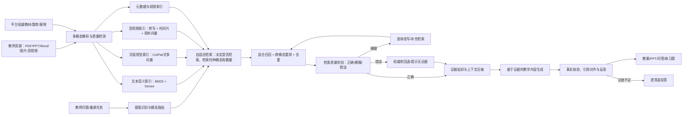

# 多模态RAG论文阅读：项目可用技术与创新点

## 1. 阅读范围与结论

本笔记基于项目论文库中的27篇论文整理，共622页，覆盖：

- 多模态解析与向量化：CLIP、LayoutLMv3、Donut、Whisper、ImageBind、BLIP-2、ColPali；
- 语义检索与知识增强：RAG、DPR、ColBERT、HyDE、MuRAG、RA-CM3、MRAG综述、Lost in the Middle；
- 幻觉抑制与评测：Self-RAG、CRAG、CRITIC、结构化输出幻觉抑制、RAGAS、ARES、不可回答性评测；
- 前沿策略：多模态RAG综述、M2RAG、自适应多模态RAG、DRAGIN等。

论文库位置：`C:\Users\12480\Desktop\服务外包\服务外包-文献综述和研究思路\多模态RAG论文库`

总体判断：项目不宜只做“文档切片 + 向量数据库 + 大模型”的普通RAG。更有价值的技术路线是：

> 面向教师私有资源与平台权威资源，构建保留文档视觉结构和音视频时间结构的多模态知识库；根据问题动态选择文本、页面图像和音视频证据，执行混合召回、跨模态重排和检索纠错；生成时建立逐条事实与证据的对应关系，在证据不足时主动澄清或拒答。

### 论文标注说明

- 正文中的`[P01]`至`[P27]`对应本笔记第7节“27篇论文与项目用途对照”。
- 一个判断后有多个编号，表示该方案是对多篇论文的综合，而非由单篇论文直接提出。
- “项目建议”属于在论文方法基础上结合本项目需求所做的工程推演；引用编号用于标明其技术来源，不代表原论文已经实现完整教学场景。

---

## 2. 建议的总体技术架构

---

## 3. 可直接用于项目的技术

### 3.1 多模态数据解析与向量化

#### 3.1.1 文档解析采用“双通道”，而不是只做OCR

建议为PDF、PPT、Word建立两个并行通道：

1. **结构化文本通道**
   - 提取标题、段落、列表、表格、公式、图片说明、页码和章节层级；
   - 使用OCR处理扫描页，保留文字坐标和页码；
   - 生成便于关键词检索和语义检索的文本块。

2. **页面视觉通道**
   - 将完整页面渲染为图像；
   - 直接生成页面级或图像块级多向量；
   - 保留图表、字体、空间关系和版面信息。

论文依据：

- LayoutLMv3将文本、图像和版面位置联合建模，说明教学文档中的空间结构具有语义价值。[P02]
- Donut指出传统OCR可能产生计算开销、语言适配困难和误差级联。[P03]
- ColPali直接嵌入文档页面图像，通过多向量后期交互完成检索，避免完全依赖脆弱的OCR流水线。[P07]

项目落地：

- 教材正文、教案段落走文本通道；
- 几何图、实验流程图、PPT信息图、复杂表格优先走视觉通道；
- 两条通道均保留`resource_id/page/section/bbox`，检索后可以回到原页高亮证据。

#### 3.1.2 图片采用视觉-语言共享空间

CLIP证明可以使用对比学习把图像和自然语言映射到共享空间；BLIP-2通过轻量Q-Former连接冻结视觉编码器和语言模型；ImageBind进一步把文本、图像、音频等六种模态绑定到统一空间。[P01][P05][P06]

项目可用方式：

- 教师用文字查询“串联电路示意图”，直接召回图片；
- 教师上传一张图，反向检索相似课件页、案例和讲解视频；
- 为图片生成“视觉向量 + 自动描述 + OCR文字”三类表示，提高召回稳定性；
- 图片描述只作为辅助索引，原图向量和原始证据不能被描述文本替代。

#### 3.1.3 音视频采用“转写 + 时间片 + 多模态向量”

Whisper表明大规模弱监督可以获得较强的多语种、跨噪声语音识别能力；ImageBind提供音频、视频与文本对齐思路。[P04][P05]

建议流程：

1. 提取音轨并用Whisper生成带时间戳的转写；
2. 按语义停顿和主题变化切分，而不是机械固定时长；
3. 每个片段保存`start_time/end_time/transcript/keyframes`；
4. 文本转写进入文本索引，关键帧进入视觉索引，音频进入音频向量索引；
5. 检索结果直接跳转到视频对应时间点。

#### 3.1.4 教学语义分块

普通固定长度切片容易割裂“教学目标—知识点—例题—答案—解析”的关系。多模态RAG综述也将数据预处理、分块和跨模态组织视为索引阶段的重要环节。[P14][P24] 建议采用教学结构感知分块：

- 教材：章—节—知识点—例题—习题；
- 教案：教学目标—重点难点—教学过程—课堂活动—评价；
- PPT：页—标题—正文—图表—备注；
- 视频：主题片段—讲解—演示—提问—总结。

同时建立父子块：小块用于精准召回，父块用于补足上下文。

---

### 3.2 语义检索与知识增强策略

#### 3.2.1 稀疏、稠密和视觉检索三路召回

建议不要只使用单一向量检索，而采用三路召回：

| 检索通道 | 主要作用 | 适合问题 |
|---|---|---|
| BM25/关键词 | 精确匹配术语、公式编号、人名、教材章节 | “机器学习第四章”“公式3-2” |
| DPR类稠密检索 | 处理同义表达和自然语言问题 | “怎么让学生理解过拟合” |
| ColPali/跨模态检索 | 检索图表、版面、课件页和视觉证据 | “找一张串并联对比图” |

DPR显示稠密双编码器可以显著提升开放域问答召回，但稀疏检索仍能为精确术语和长尾实体提供互补，因此项目应保留BM25，并使用RRF或加权融合合并结果。[P09][P14][P23]

#### 3.2.2 多阶段检索与重排序

推荐流程：

1. 按权限、资源状态及用户明确指定的课程和版本预过滤；
2. BM25、稠密检索和ColPali等通道分别快速召回Top-N；
3. 将系统推测的学段、学科和章节作为软约束进行结果融合；
4. 对候选证据重排序、去重并保证子问题覆盖；
5. 生成答案前再次复核权限。

即：确定且涉及安全的条件先过滤，不确定的语义条件用于排序。[P14][P24]

ColBERT用token级表示和MaxSim后期交互兼顾效率与细粒度相关性；ColPali把这一思想扩展到文档图像块。[P07][P10] 项目可将“初召回便宜、精排昂贵”作为分层设计原则。[P14][P23]

#### 3.2.3 查询改写与教师意图展开

HyDE先生成一个假设性文档，再用其向量寻找真实文档，适合将教师口语化需求转换为教材表达。但假设文档本身可能包含幻觉，因此只能用于检索，不应作为最终事实来源。[P11]

项目建议：

- 将“做一节有趣的勾股定理公开课”展开为：教学目标、先备知识、生活案例、动态图示、课堂练习等子查询；
- 同时生成关键词查询、语义查询和视觉查询；
- 所有查询扩展词仅用于召回，最终生成必须基于真实资源。

#### 3.2.4 多模态非参数记忆

RAG将参数记忆与可更新的外部非参数记忆结合；MuRAG进一步从图像和文本组成的多模态记忆中检索证据；RA-CM3说明检索到的多模态示例也可增强多模态生成。[P08][P12][P13] M2RAG则进一步把研究范围扩展到“多模态检索—多模态输出”，可为项目生成图文混排课件和互动材料提供任务定义及评价参考。[P25]

项目可构建：

- 教师私有知识记忆；
- 学校/平台权威知识记忆；
- 社区案例与Skill记忆；
- 历史教学成果记忆。

四类记忆应有不同的权重、权限和引用标签，不能简单混入一个无来源向量库。

#### 3.2.5 自适应检索，而不是固定Top-k

Self-RAG、DRAGIN和自适应多模态RAG共同说明：并非每个请求都需要检索，也不应为所有问题固定检索相同数量的文档。[P16][P26][P27]

建议设计检索控制器，决定：

- 是否需要检索；
- 查询哪种模态；
- 查询个人库、权威库还是社区库；
- 召回多少条；
- 是否需要二次检索。

例如“把标题改成红色”无需检索；“解释牛顿第二定律并引用教材”必须检索；“找一段实验演示视频”应优先查询视频和关键帧索引。

#### 3.2.6 上下文压缩与证据排序

Lost in the Middle证明，即便模型支持长上下文，关键信息位于上下文中部时利用效果也可能下降。因此不能把大量召回结果直接塞入提示词。[P15]

建议：

- 先重排，再压缩，再生成；
- 关键证据放在上下文前部，并在生成要求附近重复简短证据索引；
- 去除导航、页眉页脚和重复段落；
- 保留事实句、限定条件、公式和来源定位；
- 对多跳问题按推理顺序组织证据，而不是只按相似度排序。

---

### 3.3 内容幻觉抑制技术

#### 3.3.1 检索结果质量分级

CRAG将检索结果判断为`Correct / Ambiguous / Incorrect`，再触发不同动作。[P17] 项目可以实现三级证据门控：

- **可信**：权威来源、相关性高、多个证据一致，直接进入生成；
- **模糊**：证据部分相关或相互冲突，进行查询改写、扩大检索或请教师澄清；
- **不可信**：无相关证据或来源不合规，不允许模型据此断言。

这比“相似度超过某个阈值就生成”更可靠。

#### 3.3.2 分解—过滤—重组检索内容

CRAG强调完整文档中常包含大量无关内容，并采用分解—过滤—重组思路提高证据利用率。[P17] 项目应把召回页面进一步分解为知识单元，过滤无关信息后再重组上下文：

- 文本：保留直接回答问题的句子及必要上下文；
- 表格：保留表头、目标行列和单位；
- 图片：保留图片、图注及被引用段落；
- 视频：保留目标时间片转写和关键帧。

#### 3.3.3 按需检索与生成自我批判

Self-RAG利用反思标记判断是否检索、证据是否相关、回答是否被支持以及答案质量。[P16] 项目不一定需要重新训练Self-RAG模型，可以把思想实现为显式工作流：

1. 生成回答草稿；
2. 拆分为原子事实；
3. 对每条事实检查是否有证据支持；
4. 删除、改写或标记无支持内容；
5. 输出答案与引用映射。

#### 3.3.4 工具交互式核验

CRITIC说明模型可以借助外部工具对初稿进行批判和修正。[P18] 教学项目可按内容类型调用不同核验工具：

- 数学：计算器或Python验证计算过程；
- 编程：沙箱运行代码和测试用例；
- 事实：回查权威教材和平台知识库；
- 引用：核验引用片段确实包含对应观点；
- 课件结构：规则检查教学目标、活动、评价是否完整。

#### 3.3.5 证据不足时主动拒答

不可回答性评测研究指出，RAG系统不仅要回答有答案的问题，还应识别知识库中没有答案的问题。[P22] 项目应提供三种安全输出：

- “当前知识库未找到足够依据”；
- “找到的资料存在冲突，请选择教材版本”；
- “请补充年级、学科或章节信息”。

拒答不是失败，而是教学内容可靠性的组成部分。

#### 3.3.6 逐条引用与来源可追溯

生成内容中的关键事实应绑定：

- 文件名称；
- 页码或视频时间戳；
- 资源归属（个人/平台/社区）；
- 版本和更新时间；
- 证据片段。

对于PPT和Word导出，可在教师备注、脚注或附录中保留来源。结构化输出研究表明，RAG也适合约束工作流、JSON或教案结构的生成，但仍需字段级校验。[P19]

---

## 4. 建议提炼的项目创新点

以下创新点是基于已有研究的工程组合创新，不应表述为“首次提出CLIP、RAG或Self-RAG”。申报时应强调它们针对教学场景的适配与闭环设计。

### 创新点1：面向教学文档的解析后文本与原生视觉双索引

**问题**：传统OCR会丢失图表、版面和空间关系；单纯页面图像检索又不利于精确术语匹配。

**方案**：同时建立结构化文本索引和ColPali式页面视觉多向量索引，由问题类型决定两者权重；检索结果统一回到页码和版面区域。

**论文依据**：[P02][P03][P07]

**创新价值**：兼顾教材文字精确检索与课件、图表、试卷等复杂视觉内容检索，特别契合教育资源形态。

### 创新点2：教学结构感知的多粒度知识单元

**问题**：固定字符切片割裂教学逻辑。

**方案**：依据章节、知识点、例题、答案、教学活动和评价环节形成父子知识块，同时保存跨页关系、图片引用和视频时间关系。

**论文依据**：[P02][P04][P14][P24]

**创新价值**：检索粒度与教学设计粒度一致，便于生成结构完整的教案、课件和练习题。

### 创新点3：由教学意图驱动的多模态自适应检索路由

**问题**：固定检索流程会造成无意义调用、噪声和成本。

**方案**：根据教师任务识别“事实问答、图片素材、视频片段、案例复用、格式修改”等意图，动态决定是否检索、检索模态、数据源及Top-k。

**论文基础**：Self-RAG、DRAGIN、自适应多模态RAG。

**论文依据**：[P16][P26][P27]

### 创新点4：权威知识与教师私有知识的双源证据融合

**问题**：个人材料具有个性化价值，但可能过时或不完整；公共知识更权威，却不一定符合教师风格。

**方案**：个人资源负责风格、案例和历史经验，平台资源负责事实与课程标准；重排阶段引入权威度、时效性、权限和个性偏好四类分数。

**论文依据**：[P08][P12][P14][P23]

**创新价值**：实现“事实以权威库为准、表达以教师资源为参考”的可解释融合。

### 创新点5：检索质量驱动的纠错式RAG闭环

**问题**：RAG也会因错误检索而产生“有依据的幻觉”。

**方案**：对召回证据进行可信/模糊/不可信分级；模糊时改写查询并二次检索，不可信时回退权威库或拒答；生成后再做事实—证据对齐。

**论文基础**：CRAG、Self-RAG、CRITIC。

**论文依据**：[P16][P17][P18]

### 创新点6：面向教学成果的声明级证据链

**问题**：普通RAG只展示若干参考来源，无法说明每个结论由哪段材料支持。

**方案**：把生成结果拆成原子声明，为每条声明保存证据、页码、时间戳和可信度；导出PPT/Word时保留可追溯信息。

**论文依据**：[P16][P19][P20][P21]

**创新价值**：支持教师审核、内容纠错和成果追责，增强教育应用中的可信性。

### 创新点7：不可回答检测与教师澄清机制

**问题**：知识库无答案或问题条件不足时，大模型容易强行补全。

**方案**：建立证据覆盖率和冲突检测；低于阈值时触发澄清问题、显示缺失信息或拒答。

**论文依据**：[P17][P22]

**创新价值**：把“拒绝无依据生成”设计为教学安全机制，而非异常处理。

### 创新点8：多维度教学RAG评测体系

RAGAS和ARES将评测拆成上下文相关性、答案忠实度和答案相关性。[P20][P21] 项目可扩展为：

- 检索层：Recall@k、MRR、nDCG、视觉证据召回率；
- 生成层：正确性、忠实度、完整性、引用准确率；
- 安全层：不可回答识别率、错误拒答率、冲突检测率；
- 教学层：课程标准一致性、难度适配、教学结构完整性；
- 系统层：延迟、Token成本、索引更新时间和权限泄漏率。

---

## 5. 推荐的MVP技术路线

### 第一阶段：可以较快实现

1. 文档解析：PDF/Word/PPT文本提取 + OCR兜底；
2. 音视频：Whisper转写与时间戳切片；
3. 索引：BM25 + 中文/多语种文本Embedding；
4. 融合：RRF合并稀疏和稠密召回；
5. 重排：Cross-Encoder或轻量LLM重排；
6. 生成：强制引用来源和页码；
7. 纠错：检索质量阈值 + 二次检索 + 无证据拒答；
8. 评测：构建100-300条项目内测试问题。

### 第二阶段：形成项目特色

1. 引入ColPali式页面视觉检索；
2. 建立图片、视频关键帧与文本的跨模态检索；
3. 实现意图驱动的模态路由和动态Top-k；
4. 建立权威库与个人库双源重排；
5. 实现声明—证据对齐和冲突检测。

### 第三阶段：研究型增强

1. 根据教师反馈学习检索和重排偏好；
2. 训练教学领域轻量检索质量评估器；
3. 建立多跳教学知识检索和证据图；
4. 研究图文音视频统一向量空间的领域适配；
5. 形成面向教学多模态RAG的自建评测基准。

---

## 6. 关键实验设计

### 实验1：不同解析与索引方案

对比：

- OCR文本检索；
- 文本 + 版面模型；
- 页面视觉检索；
- 文本与页面视觉混合检索。

测试材料应包含纯文本教材、图文PPT、复杂表格、扫描试卷和公式页面。

### 实验2：不同召回与重排方案

对比：BM25、Dense、BM25 + Dense、三路混合、加入Cross-Encoder、加入ColBERT/ColPali式后期交互。

### 实验3：固定检索与自适应检索

比较固定Top-5/Top-10与动态检索在准确率、延迟、Token成本和噪声敏感性上的差异。

### 实验4：幻觉抑制消融

逐步加入：

1. 基础RAG；
2. 重排；
3. 检索质量判别；
4. 纠错检索；
5. 声明级核验；
6. 不可回答检测。

观察忠实度、引用准确率和错误回答率的变化。

### 实验5：真实教师任务

覆盖：生成教案、生成PPT大纲、查找图片、定位视频片段、生成练习题、回答教材问题、修改已有课件。由教师评价可用性、正确性、节省时间和可控性。

---

## 7. 27篇论文与项目用途对照

| 论文标识 | 论文/技术 | 对项目的主要价值 |
|---|---|---|
| P01 | CLIP | 图文共享嵌入、文字搜图、以图搜资源 |
| P02 | LayoutLMv3 | 文本、图像和版面联合文档理解 |
| P03 | Donut | 无OCR文档理解及OCR误差级联分析 |
| P04 | Whisper | 课堂录音和教学视频转写 |
| P05 | ImageBind | 文本、图像、音频等统一向量空间 |
| P06 | BLIP-2 | 低成本连接视觉编码器与语言模型 |
| P07 | ColPali | 教材/PPT页面原生视觉多向量检索 |
| P08 | RAG | 参数记忆与可更新外部知识结合 |
| P09 | DPR | 稠密双编码器语义召回 |
| P10 | ColBERT | token级后期交互和精细重排 |
| P11 | HyDE | 模糊教学需求的假设文档查询扩展 |
| P12 | MuRAG | 同时检索图像和文本证据 |
| P13 | RA-CM3 | 用外部多模态记忆增强多模态生成 |
| P14 | MRAG综述 | 多模态RAG组件、数据集与评测全景 |
| P15 | Lost in the Middle | 重排、压缩和证据位置的重要性 |
| P16 | Self-RAG | 按需检索、证据评价和生成自我反思 |
| P17 | CRAG | 检索质量分级、纠错检索和内容过滤 |
| P18 | CRITIC | 使用外部工具核验并修正生成结果 |
| P19 | 结构化输出幻觉抑制 | 教案、任务计划和结构化成果的RAG约束 |
| P20 | RAGAS | 上下文相关性、忠实度、答案相关性评测 |
| P21 | ARES | 少量人工标注下的自动化RAG评测 |
| P22 | 不可回答性评测 | 无证据问题识别、拒答和澄清 |
| P23 | 检索增强趋势综述 | 检索时机、策略和结果利用的中文框架 |
| P24 | 多模态RAG综合综述 | 查询、检索、融合、增强、生成分类 |
| P25 | M2RAG | 多模态输入到多模态输出及评价基线 |
| P26 | 自适应多模态RAG | 动态控制检索数量、降低噪声 |
| P27 | DRAGIN | 根据模型信息需求决定何时检索、检索什么 |

---

## 8. 写入文献综述第3章的推荐结构

### 3.1 多模态数据解析与向量化

按“单模态解析 → 跨模态对齐 → 原生视觉文档检索”展开：

1. OCR、ASR和文档版面理解；
2. CLIP、BLIP-2和ImageBind的共享语义空间；
3. ColPali代表的页面原生多向量检索；
4. 现有方法在教学领域的不足：缺乏教学结构、资源权限和音视频时间关系建模。

### 3.2 语义检索与知识增强策略

按“召回 → 重排 → 多模态增强 → 自适应控制”展开：

1. BM25与DPR的互补；
2. ColBERT/ColPali的后期交互；
3. HyDE查询扩展；
4. RAG、MuRAG与RA-CM3的外部记忆；
5. 动态检索、上下文压缩和Lost in the Middle问题。

### 3.3 内容幻觉抑制技术

按幻觉产生环节分类：

1. 检索失败：CRAG式质量判别与纠错；
2. 证据噪声：分解、过滤、重排和上下文压缩；
3. 生成不忠实：Self-RAG反思与CRITIC工具核验；
4. 知识库无答案：不可回答检测、澄清和拒答；
5. 系统评价：RAGAS、ARES及项目教学指标。

---

## 9. 最终建议

项目最值得突出的一条主线是：

> **从“多模态资源能被检索”升级为“多模态证据可被理解、纠错、引用和拒答”。**

技术选择上，MVP先完成文本混合检索、重排、引用和拒答，再加入ColPali式视觉页面检索。研究和申报材料中，可将“教学结构感知双索引、自适应模态路由、双源证据融合、纠错式RAG和声明级证据链”作为五个核心创新点。
