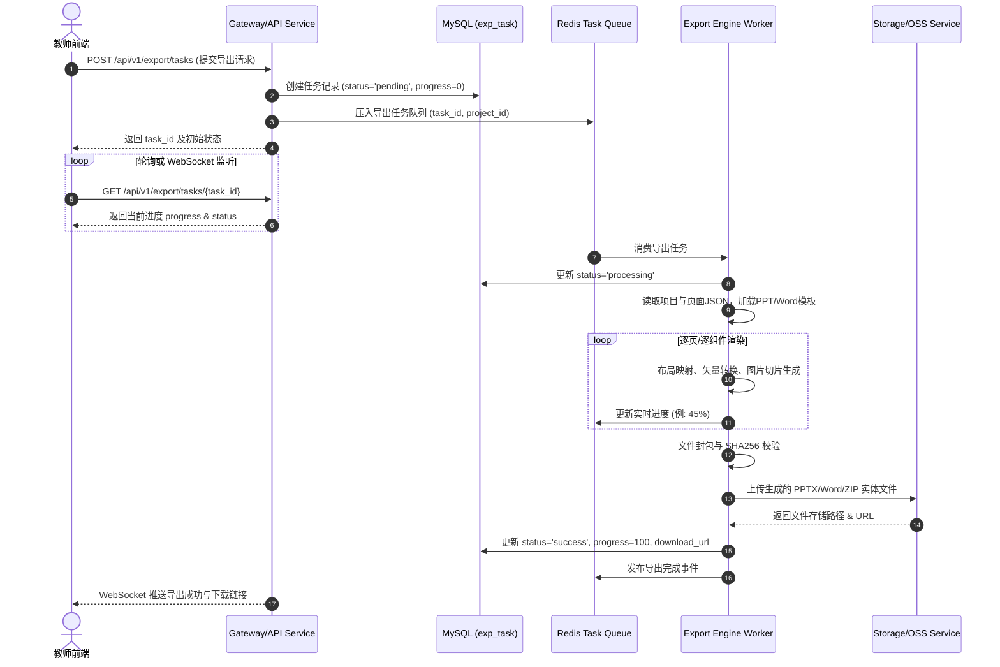

# 多模态 AI 互动式教学智能体系统 - 详细设计说明书

## 3.5 功能模块 5：成果导出中心 (Detailed Design)

### 3.5.1 程序描述
* **模块定位与目标**：成果导出中心是系统核心的后端交付引擎，负责将教师在智能创作工作台中完成的交互式多模态教学方案（含 PPT 结构图文、 Word 教案文本、音视频素材及 H5 互动组件）精准转化为符合国家标准规范的静态与动态文件。
* **主要功能**：支持一键渲染并下载 `.pptx` 课件、`.docx` 教学设计案、H5 互动展示包以及混合资源打包。
* **驻留与执行机制**：采用“前端异步触发 + 后端任务队列异步渲染 + 持久化存储 + WebSocket/SSE 消息推送”机制。导出服务常驻后台异步 Worker 线程组（基于 Celery / Python-FastAPI 后台任务队列），不阻塞主 Web 业务线程。

---

### 3.5.2 功能
* **模块功能清单**：
  1. **多格式导出配置**：支持选择导出目标格式（PPTX、Word 教案、H5 包、混合压缩包），支持设置样式模板、页眉页脚、教师注解显示开关、导出页码范围。
  2. **异步导出任务调度**：生成全局唯一导出任务 `task_id`，加入优先级队列，支持实时进度查询与取消。
  3. **高保真排版与渲染**：
     * **PPTX 导出**：将前端 Canvas/JSON 结构化组件映射为原生 PowerPoint 元素（文本框、矢量形状、图形表格、嵌入式图片/音视频），确保矢量可编辑。
     * **Word 教案导出**：将教学设计大纲、CoT 逻辑链、教学目标与活动表按国标教案格式（宋体/黑体、标准行距、表格边框）渲染为标准的 `.docx` 文档。
  4. **导出预览与结果校验**：完成渲染后进行文件完整性校验与格式合规性检查，自动生成防盗链临时下载 URL（有效期 24 小时）。

* **IPO 图 (Input-Process-Output)**：
  ```
  +-----------------------------------+     +----------------------------------------+     +----------------------------------+
  |             输入 (Input)           |     |              处理 (Process)            |     |            输出 (Output)         |
  +-----------------------------------+     +----------------------------------------+     +----------------------------------+
  | 1. 项目ID (project_id)            | --> | 1. 鉴权与项目快照提取                 | --> | 1. 导出任务实体 (exp_task)       |
  | 2. 导出类型 (export_type)         |     | 2. JSON到OpenXML/PPTX结构化转换映射     |     | 2. 任务状态与进度 (%)            |
  | 3. 配置项JSON (config):            |     | 3. 矢量图形渲染与媒体切片打包          |     | 3. 结果文件 (sys_file)           |
  |    - template_id, header_footer  |     | 4. 国标排版合规性校验                  |     | 4. 24h带签名下载链接 (download_url)|
  |    - teacher_notes, page_range   |     | 5. 文件生成、Hash校验与OSS异步上传      |     |                                  |
  +-----------------------------------+     +----------------------------------------+     +----------------------------------+
  ```

---

### 3.5.3 性能
* **响应时间指标**：
  * **导出任务创建接口响应时间**：$\le 300\text{ ms}$。
  * **单页 PPTX 页面渲染耗时**：$1 \sim 3\text{ 秒/页}$。
  * **完整课件包（15-20页PPTX + Word教案）总导出耗时**：$1 \sim 3\text{ 分钟}$。
  * **异步进度更新延迟**：$\le 500\text{ ms}$。
* **并发吞吐能力**：单个导出 Worker 节点支持同时并发处理 20 个导出任务，后台队列支持 1000+ 任务排队。
* **文件存储粒度**：生成的导出的单个 PPTX/DOCX 文件大小上限不超过 $500\text{ MB}$。

---

### 3.5.4 输入项
* **入口参数与依赖数据**：
  * `user_id` (INT)：当前操作教师的用户 ID。
  * `project_id` (INT)：工作台中的目标教学设计项目 ID。
  * `export_type` (VARCHAR(20))：导出目标类型，可选值：`pptx` | `word` | `package`。
  * `config` (JSON)：导出参数配置对象，包含：
    * `template_id` (INT)：排版样式模板 ID。
    * `header_footer` (OBJECT)：页眉页脚文本及格式。
    * `teacher_notes` (BOOLEAN)：是否保留教师备注与 CoT 教学提示。
    * `h5_handling` (VARCHAR(20))：H5 互动组件处理策略（`embed_qr` 嵌入二维码 / `static_snapshot` 截取静态图）。
    * `page_range` (ARRAY)：导出页面序号列表，为空表示导出全部。

---

### 3.5.5 输出项
* **导出产出与出口参数**：
  * **响应数据对象**：
    * `task_id` (INT)：后端创建的导出任务唯一标识。
    * `status` (VARCHAR(20))：任务状态（`pending` | `processing` | `success` | `failed`）。
    * `progress` (INT)：当前完成百分比 (0-100)。
    * `download_url` (VARCHAR(500))：带安全签名的下载 URL（仅在状态为 `success` 时有效）。
    * `quality_report` (JSON)：排版合规检查与格式导出结果报告。
  * **物理存储实体**：存储于服务器 `/data/files/export/` 或云端 OSS 中的文件实体，且在数据库 `sys_file` 表中注册记录。

---

### 3.5.6 算法
1. **结构化 JSON 至 OpenXML/PPTX 元素映射渲染算法**：
   * **输入**：`ws_page` 中的组件树 JSON（包含坐标 `x,y,w,h`、字体、颜色、文本内容、图片路径、表格矩阵）。
   * **算法步骤**：
     1. 读取对应 `template_id` 的 PPTX 母版文档基础样式。
     2. 遍历页面组件列表，按 `z-index` 升序排列。
     3. 若组件为文本框：依据相对比例计算 OpenXML 的 `EMU` 坐标（$1\text{ pt} = 12700\text{ EMU}$），设置段落缩进、行距及字体颜色矩阵。
     4. 若组件为矢量图形：使用 `python-pptx` Shape 接口重建矩形、圆角框与箭头。
     5. 若组件为互动 H5/音视频：调用 PhantomJS/Playwright 截取当前组件高清渲染图（300 DPI），并将其作为 Image Part 替代插入，同时附带跳转二维码或嵌入原生媒体播放流。
     6. 保存生成文档并计算 SHA256 校验和。

2. **导出队列滑动窗口与状态回调算法**：
   * 采用 Redis 维护任务优先队列 `export:queue:high` 与 `export:queue:normal`。导出服务定期刷新任务运行锁，每完成一个页面的渲染向 Redis 发布 `export:progress:<task_id>` 订阅消息，推动 WebSocket 客户端实时同步进度条。

---

### 3.5.7 逻辑流程
* **详细逻辑流程图 (Mermaid)**：



---

### 3.5.8 接口

#### 3.5.8.1 用户接口 (人机界面 / UI交互设计)
1. **导出弹窗面板**：
   * 包含导出格式切换 Radio Button（PPTX 课件 / Word 教案 / 压缩包）。
   * 包含导出高级配置项：样式模板下拉框、是否导出教师注解 Checkbox、H5 组件导出模式选择框。
2. **下载进度条弹窗**：
   * 动态呈现百分比进度条与状态提示（如：“正在渲染第 3/15 页 PPT...”）。
   * 具备“后台运行”与“取消导出”按钮。
3. **完成提示与一键下载**：
   * 导出成功后弹出绿色完成状态，显示文件大小及“立即下载”按钮，同时提示“链接有效期为 24 小时”。

#### 3.5.8.2 外部接口
* **OSS 云存储 API**：向阿里云 OSS 或 MinIO 上传生成的二进制文件，接口参数包含 `BucketName`、`ObjectKey`、`InputStream`，返回物理 URL。
* **Office 文档格式校验微服务 API**：通过 LibreOffice 无头模式对生成的 PPTX/DOCX 进行校验，转换预览 PDF 页。

#### 3.5.8.3 内部接口

##### 1. 创建导出任务
* **接口路径**：`POST /api/v1/export/tasks`
* **请求 Header**：`Authorization: Bearer <Token>`
* **请求体 (Request Body)**：
  ```json
  {
    "project_id": 1024,
    "export_type": "pptx",
    "config": {
      "template_id": 3,
      "header_footer": {
        "header_text": "高中物理人教版 - 动量守恒定律",
        "show_page_number": true
      },
      "teacher_notes": true,
      "h5_handling": "embed_qr",
      "page_range": [1, 2, 3, 4, 5]
    }
  }
  ```
* **响应体 (Response Body)**：
  ```json
  {
    "code": 200,
    "message": "导出任务创建成功，已加入队列",
    "data": {
      "task_id": 8848,
      "status": "pending",
      "progress": 0,
      "estimated_seconds": 45,
      "created_at": 1721800000.0
    }
  }
  ```

##### 2. 查询导出任务状态与进度
* **接口路径**：`GET /api/v1/export/tasks/{task_id}`
* **请求参数**：Path 参数 `task_id` (INT)
* **响应体 (Response Body)**：
  ```json
  {
    "code": 200,
    "message": "success",
    "data": {
      "task_id": 8848,
      "project_id": 1024,
      "export_type": "pptx",
      "status": "success",
      "progress": 100,
      "download_url": "https://oss.domain.com/exports/20260724/task_8848.pptx?sign=abc123xyz&expires=1721886400",
      "file_info": {
        "file_name": "动量守恒定律_交互式课件.pptx",
        "file_size": 24589102,
        "mime_type": "application/vnd.openxmlformats-officedocument.presentationml.presentation"
      },
      "quality_report": {
        "page_count": 5,
        "warning_count": 0,
        "format_check": "passed"
      },
      "finished_at": 1721800042.5
    }
  }
  ```

##### 3. 取消导出任务
* **接口路径**：`POST /api/v1/export/tasks/{task_id}/cancel`
* **响应体 (Response Body)**：
  ```json
  {
    "code": 200,
    "message": "导出任务已终止",
    "data": { "task_id": 8848, "status": "failed" }
  }
  ```

##### 4. 获取导出预览元数据
* **接口路径**：`GET /api/v1/export/preview/{project_id}`
* **响应体 (Response Body)**：
  ```json
  {
    "code": 200,
    "message": "success",
    "data": {
      "project_id": 1024,
      "total_pages": 15,
      "has_h5_components": true,
      "supported_formats": ["pptx", "word", "package"]
    }
  }
  ```

---

### 3.5.9 存储分配

#### 1. 核心表：`exp_task`（成果导出任务表）
| 字段名 | 数据类型 | 允许空 | 默认值 | 说明 |
| :--- | :--- | :--- | :--- | :--- |
| `id` | INT(11) | NO | AUTO_INCREMENT | 主键，导出任务 ID |
| `user_id` | INT(11) | NO | NULL | 外键，关联 `sys_user.id` |
| `project_id` | INT(11) | NO | NULL | 外键，关联 `ws_project.id` |
| `export_type` | VARCHAR(20) | NO | 'pptx' | 导出类型（`pptx`/`word`/`package`） |
| `config` | JSON | YES | NULL | 导出参数 JSON（模板、注解、页码范围等） |
| `status` | VARCHAR(20) | NO | 'pending' | 任务状态（`pending`/`processing`/`success`/`failed`） |
| `progress` | INT(11) | NO | 0 | 当前进度 (0-100) |
| `result_file_id` | BIGINT(20) | YES | NULL | 关联的最终生成文件 ID（`sys_file.id`） |
| `download_url` | VARCHAR(500) | YES | NULL | 带鉴权签名的防盗链下载 URL |
| `quality_report` | JSON | YES | NULL | 排版检查与导出质量反馈 JSON |
| `error_message` | VARCHAR(500) | YES | NULL | 失败时的异常原因记录 |
| `created_at` | FLOAT | NO | NULL | 任务创建 Unix 时间戳 |
| `finished_at` | FLOAT | YES | NULL | 任务完成 Unix 时间戳 |

#### 2. 关联表：`sys_file`（统一文件表中的导出项记录）
导出生成的文件元数据统一记录于 `sys_file`，其中 `biz_type = 'export'`，`biz_id = exp_task.id`。

#### 3. 存储位置与空间规划
* **数据库索引分配**：在 `exp_task` 表上建立组合索引 `idx_user_status (user_id, status)` 及 `idx_created (created_at)`。
* **物理文件存储路径**：服务器本地热存储目录 `/data/files/export/YYYYMMDD/`，OSS Bucket 命名为 `edu-agent-exports/`。
* **过期清理策略**：定时脚本每 24 小时自动清理 `/data/files/export/` 中超过 7 天的物理文件，同时同步更新数据库记录。

---

### 3.5.10 注释设计
* **代码注释规范**：
  * 所有导出渲染器基类（如 `BaseExporter`）及派生类（`PPTXExporter`、`DocxExporter`）必须具备完整的 Docstring 说明。
  * 关键坐标算法与 OpenXML 转换函数需标注单位转换依据（如 `1 pt = 12700 EMU`）。
  * 异步 Task 函数头必须标注 `@celery.task(bind=True, max_retries=3)` 属性说明。

---

### 3.5.11 限制条件
1. **任务运行超时限制**：单个导出任务最大运行时间不得超过 $600\text{ 秒}$ (10 分钟)，超时Worker 将自动杀掉进程并将 `status` 置为 `failed`。
2. **下载 URL 效期限制**：生成的签名 URL 默认有效期为 24 小时，超时后需重新请求生成。
3. **环境依赖限制**：导出 Worker 必须运行于安装有 LibreOffice、PhantomJS/Playwright 环境的 Linux 镜像中。

---

### 3.5.12 测试计划
* **测试方法**：单元测试（PyTest） + 性能集成测试（JMeter）。
* **测试用例集**：
  1. **格式转换正确性测试**：验证包含文本、图片、复杂表格、数学公式的 Canvas 项目导出为 `.pptx` 后排版不重叠、字体正常。
  2. **并发压力测试**：模拟 50 个用户同时提交导出请求，验证 Redis 任务队列排队正常，系统无崩塌，进度推送无丢失。
  3. **异常恢复测试**：模拟在渲染第 5 页时强制中断 Worker 进程，验证系统能否捕获任务失败状态，并将 `error_message` 正常呈现给前端。

---

### 3.5.13 尚未解决的问题
1. **复杂前端 Canvas 自定义粒子动画与 3D 模型的导出保真度损失**：由于静态 PPTX 格式限制，目前 3D 动画组件只能降级导出为 2D 高清快照，未来计划引入 OpenXML 3D Model 扩展标签支持。

---
---

## 3.6 功能模块 6：社区模块（技能与案例广场）(Detailed Design)

### 3.6.1 程序描述
* **模块定位与目标**：社区模块（技能与案例广场）是整个互动式教学智能体平台的开放共享与二次创作中心。教师可在广场中浏览、检索、使用他人分享的优质教学 Prompt（Skill 智能体技能模板）及高质教学设计工程案例，并可“一键派生（Derivation）”至个人工作台进行二次创作与定制化修改。
* **驻留与执行机制**：基于 SpringBoot / FastAPI 控制器层提供高并发 Read-Heavy 缓存接口。配合分布式内容审核与搜索引擎（Elasticsearch / Redis Search），实现高性能全文检索与热度推荐。

---

### 3.6.2 功能
* **模块功能清单**：
  1. **广场内容浏览与多维检索**：支持按内容类型（Skill 技能 / 教学案例）、学科（语文/数学/物理等）、学段（小学/初中/高中/大学）、热度/时间/派生量进行筛选与关键词搜索。
  2. **详情查看与交互预览**：提供 Skill 指令结构预览、项目快照交互式预览、作者信息及社区互动统计数据（查看数、使用数、收藏数、派生次数）。
  3. **一键派生与二次创作 (Derivation)**：教师可选择广场中任意公开的案例或 Skill，一键派生复制一份完整的项目快照至个人工作台，建立版本衍生溯源关系。
  4. **个人创作分享与发布申请**：教师可将自己的优秀教学项目或 Skill 提交发布至广场，触发系统敏感词过滤与管理员审核流程。
  5. **社区互动管理**：提供点赞、收藏、取消收藏、派生记录查询及违规内容举报功能。

* **IPO 图 (Input-Process-Output)**：
  ```
  +-----------------------------------+     +----------------------------------------+     +----------------------------------+
  |             输入 (Input)           |     |              处理 (Process)            |     |            输出 (Output)         |
  +-----------------------------------+     +----------------------------------------+     +----------------------------------+
  | 1. 查询条件 (subject, grade,      | --> | 1. 审核状态过滤 (status='published')    | --> | 1. 广场内容分页列表 (com_content) |
  |    content_type, keyword, sort)   |     | 2. 热度与时间衰减综合推荐排序计算      |     | 2. 案例快照实体与预览 JSON        |
  | 2. 目标内容ID (item_id)           |     | 3. 快照项目深拷贝与派生溯源链路建立    |     | 3. 新派生创建的项目ID             |
  | 3. 互动动作 (action: favorite/    |     | 4. 社区互动防重控制与统计计数器自增    |     |    (target_project_id)          |
  |    derivation)                    |     | 5. 内容发布安全审核触发                |     | 4. 互动状态与操作结果             |
  +-----------------------------------+     +----------------------------------------+     +----------------------------------+
  ```

---

### 3.6.3 性能
* **响应时间指标**：
  * **广场列表查询与分页响应时间**：$\le 200\text{ ms}$（基于 Redis 缓存）。
  * **全文关键词搜索响应时间**：$\le 1\text{ 秒}$。
  * **一键派生（快照项目复制）耗时**：$\le 1\text{ 秒}$（深拷贝项目及页面 JSON）。
* **并发吞吐能力**：广场浏览查询接口支持 $2000+\text{ QPS}$ 的高并发并发访问。
* **数据检索容量**：支持 100 万+ 社区 Skill 与案例数据的毫秒级检索。

---

### 3.6.4 输入项
* **入口参数与依赖数据**：
  * **列表查询参数**：
    * `content_type` (VARCHAR(20))：`skill` | `case` | `all`。
    * `subject` (VARCHAR(50))：学科筛选。
    * `grade` (VARCHAR(50))：学段筛选。
    * `sort_by` (VARCHAR(20))：排序模式（`latest` / `popular` / `most_derived`）。
    * `page` (INT) & `page_size` (INT)：分页参数。
  * **一键派生输入参数**：
    * `item_id` (INT)：社区目标内容 ID。
    * `target_folder_id` (INT)：保存至个人工作台的目标文件夹 ID。
  * **内容发布提交参数**：
    * `project_id` (INT)：欲分享的个人项目 ID。
    * `title` (VARCHAR(200)) & `description` (VARCHAR(500))：分享标题与说明。
    * `tags` (ARRAY)：标签数组。

---

### 3.6.5 输出项
* **产出数据与出口参数**：
  * **社区内容对象列表 (`items`)**：包含 `id`, `title`, `description`, `content_type`, `author_info`, `cover_image`, `stats` (点赞数/派生数/查看数), `created_at`。
  * **派生创建结果**：返回新生成的个人项目 ID `new_project_id`，并自动跳转至工作台编辑模式。
  * **互动结果记录**：生成 `com_interaction` 记录项及更新后的互动计数。

---

### 3.6.6 算法
1. **广场综合热度衰减推荐排序算法**：
   * **目标**：兼顾优质高赞内容与最新发布的案例，避免老旧案例长期占榜。
   * **热度得分公式**：
     $$Score = \frac{S_{view} \times 0.1 + S_{like} \times 1.0 + S_{fav} \times 2.0 + S_{derive} \times 5.0}{(T_{now} - T_{created} + 2)^\gamma}$$
     * 其中 $S_{view}, S_{like}, S_{fav}, S_{derive}$ 分别为查看数、点赞数、收藏数、派生二次创作数。
     * $T_{now} - T_{created}$ 为发布时间差（单位：小时）。
     * $\gamma$ 为时间衰减系数，默认取 $1.5$。
   * 系统定时任务每 15 分钟计算一次得分并更新 Redis ZSet 索引 `community:rank:<content_type>`。

2. **案例项目深拷贝与快照派生溯源算法**：
   * **算法步骤**：
     1. 验证目标 `item_id` 的状态为 `published` 且具有使用权限。
     2. 开启数据库事务，读取源快照项目 `ws_project` 及其关联的所有 `ws_page` 页面组件 JSON。
     3. 在 `ws_project` 表中插入新记录，`user_id` 设为当前派生教师，设置 `parent_project_id = source_project_id` 维护派生链。
     4. 批量拷贝插入 `ws_page` 记录，更新组件内部唯一 UUID 标识，防止 ID 冲突。
     5. 检查绑定的素材资源 `res_material`，对允许公开的素材引用建立快捷映射，私有素材复制生成拷贝。
     6. 在 `com_interaction` 表中写入 `action_type = 'derivation'` 记录，并将源内容的 `derivation_count` 自增 1。
     7. 提交事务，返回新 `project_id`。

---

### 3.6.7 逻辑流程
* **二次创作（一键派生与发布审核）逻辑流程图 (Mermaid)**：

```mermaid
flowchart TD
    Start([教师进入社区广场]) --> Browse[浏览/搜索案例或Skill]
    Browse --> Select[选择目标案例卡片]
    Select --> Choice{操作选择}
    
    Choice -- 仅点赞/收藏 --> Interact[调用 POST /interact]
    Interact --> UpdateStats[更新计数与 com_interaction 表]
    UpdateStats --> End([完成])
    
    Choice -- 一键派生二次创作 --> Derive[点击"一键派生"按钮]
    Derive --> API_Derive[请求 POST /items/{id}/derive]
    API_Derive --> DB_Copy[数据库开启事务: 深拷贝项目及页面JSON]
    DB_Copy --> RecordDerive[写入 com_interaction 派生记录]
    RecordDerive --> IncCount[源内容 derivation_count + 1]
    IncCount --> ReturnNewID[返回新 project_id]
    ReturnNewID --> OpenWorkspace[自动跳转至智能工作台进行修改]
    
    OpenWorkspace --> Edit[教师修改与个性化二次创作]
    Edit --> PublishReq{是否再次分享?}
    PublishReq -- 否 --> End
    PublishReq -- 是 --> SubmitAudit[提交发布申请 POST /items]
    SubmitAudit --> SensitiveCheck{敏感词/AI安全过滤}
    SensitiveCheck -- 违规 --> Reject[直接拒绝并提示修改]
    SensitiveCheck -- 通过 --> AdmAudit[进入 adm_audit 待审核队列]
    AdmAudit --> AdminOp{管理员审核}
    AdminOp -- 拒绝 --> NotifyReject[站内信通知拒绝原因]
    AdminOp -- 通过 --> Online[更新 status='published' 正式上线广场]
    Online --> End
```

---

### 3.6.8 接口

#### 3.6.8.1 用户接口 (人机界面 / UI交互设计)
1. **广场主界面**：
   * 顶部：Search Bar（支持输入关键字搜索）+ 分类 Tabs（全部 / 智能体 Skill / 优秀教学案例）。
   * 侧边/顶部筛选栏：学科下拉框（语文、数学、英语、物理...）+ 学段选项框（小学、初中、高中）。
   * 排序切换器：按综合热度（默认）/ 按最新发布 / 按派生最多。
2. **内容卡片 Grid 布局**：
   * 展示卡片：封面图、标题、作者头像与姓名、学科/学段 Tag、点赞数、派生数、一键派生悬浮按钮。
3. **案例详情弹窗**：
   * 展现案例完整大纲、交互课件在线预览窗口、Skill 指令 Prompt 预览区、派生历史树节点展示。

#### 3.6.8.2 外部接口
* **文本与内容安全检测 API**：在提交发布时调用阿里云/百度内容安全 API，检测 `title`、`description` 及模板中是否包含政治敏感、色情、暴恐及违禁词汇。

#### 3.6.8.3 内部接口

##### 1. 分页查询广场技能与案例列表
* **接口路径**：`GET /api/v1/community/items`
* **请求参数 (Query Parameters)**：
  * `content_type` (STRING)：`skill` | `case` | `all` (默认 `all`)
  * `subject` (STRING)：可选，如 `"physics"`
  * `grade` (STRING)：可选，如 `"senior_high"`
  * `sort_by` (STRING)：`popular` | `latest` | `most_derived`
  * `page` (INT)：页码，默认 1
  * `page_size` (INT)：每页条数，默认 12
* **响应体 (Response Body)**：
  ```json
  {
    "code": 200,
    "message": "success",
    "data": {
      "total": 128,
      "page": 1,
      "page_size": 12,
      "items": [
        {
          "id": 501,
          "content_type": "case",
          "title": "基于CoT思维导图的高中物理《动量守恒定律》探究课",
          "description": "包含启发式AI对话提示词、3组交互H5实验组件与完整PPT课件包",
          "subject": "物理",
          "grade": "高中",
          "tags": ["动量守恒", "实验探究", "CoT设计"],
          "author": {
            "author_id": 108,
            "username": "张老师",
            "avatar_url": "https://oss.domain.com/avatars/user_108.jpg"
          },
          "cover_image": "https://oss.domain.com/covers/item_501.png",
          "stats": {
            "view_count": 3420,
            "use_count": 890,
            "favorite_count": 450,
            "derivation_count": 126
          },
          "created_at": 1721750000.0
        }
      ]
    }
  }
  ```

##### 2. 获取技能/案例详情
* **接口路径**：`GET /api/v1/community/items/{item_id}`
* **响应体 (Response Body)**：
  ```json
  {
    "code": 200,
    "message": "success",
    "data": {
      "id": 501,
      "content_type": "case",
      "title": "基于CoT思维导图的高中物理《动量守恒定律》探究课",
      "description": "详细描述文本...",
      "subject": "物理",
      "grade": "高中",
      "author_id": 108,
      "snapshot_project_id": 2048,
      "skill_config_json": {
        "system_prompt": "你是一个物理教学引导助手...",
        "temperature": 0.7
      },
      "stats": {
        "view_count": 3421,
        "favorite_count": 450,
        "derivation_count": 126
      },
      "user_interaction": {
        "is_favorited": true,
        "is_derived": false
      }
    }
  }
  ```

##### 3. 一键派生 / 二次创作
* **接口路径**：`POST /api/v1/community/items/{item_id}/derive`
* **请求 Header**：`Authorization: Bearer <Token>`
* **响应体 (Response Body)**：
  ```json
  {
    "code": 200,
    "message": "派生成功！已生成新工作台工程",
    "data": {
      "source_item_id": 501,
      "new_project_id": 3096,
      "project_name": "基于CoT思维导图的高中物理《动量守恒定律》探究课 (二次创作)",
      "derived_at": 1721801200.0
    }
  }
  ```

##### 4. 社区互动操作 (点赞/收藏)
* **接口路径**：`POST /api/v1/community/items/{item_id}/interact`
* **请求体 (Request Body)**：
  ```json
  {
    "action_type": "favorite",
    "operate": "add"
  }
  ```
* **响应体 (Response Body)**：
  ```json
  {
    "code": 200,
    "message": "收藏成功",
    "data": { "item_id": 501, "favorite_count": 451, "is_favorited": true }
  }
  ```

##### 5. 发布/分享至广场
* **接口路径**：`POST /api/v1/community/items`
* **请求体 (Request Body)**：
  ```json
  {
    "project_id": 1024,
    "content_type": "case",
    "title": "我的创新教学方案",
    "description": "教学方案简介",
    "subject": "物理",
    "grade": "高中",
    "tags": ["创新", "互动"]
  }
  ```
* **响应体 (Response Body)**：
  ```json
  {
    "code": 200,
    "message": "发布申请已提交，等待审核",
    "data": { "item_id": 602, "status": "auditing" }
  }
  ```

---

### 3.6.9 存储分配

#### 1. 核心表 1：`com_content`（社区内容表）
| 字段名 | 数据类型 | 允许空 | 默认值 | 说明 |
| :--- | :--- | :--- | :--- | :--- |
| `id` | INT(11) | NO | AUTO_INCREMENT | 主键，社区内容 ID |
| `content_type` | VARCHAR(20) | NO | 'case' | 类型（`skill` / `case`） |
| `author_id` | INT(11) | NO | NULL | 发布教师 ID (`sys_user.id`) |
| `title` | VARCHAR(200) | NO | NULL | 内容标题 |
| `description` | VARCHAR(500) | YES | NULL | 内容描述 |
| `subject` | VARCHAR(50) | YES | NULL | 分类学科 |
| `grade` | VARCHAR(50) | YES | NULL | 分类学段 |
| `tags` | JSON | YES | NULL | 标签 JSON 数组 |
| `version` | INT(11) | NO | 1 | 资源版本号 |
| `snapshot_project_id`| INT(11) | YES | NULL | 关联的引用的项目快照 ID |
| `skill_config_json` | JSON | YES | NULL | Skill 智能体配置与 Prompt 模板 |
| `content_data` | JSON | YES | NULL | 案例预览摘要排版数据 |
| `status` | VARCHAR(20) | NO | 'draft' | 状态（`draft`/`auditing`/`published`/`rejected`） |
| `view_count` | INT(11) | NO | 0 | 浏览次数 |
| `use_count` | INT(11) | NO | 0 | 引用使用次数 |
| `favorite_count` | INT(11) | NO | 0 | 收藏次数 |
| `derivation_count` | INT(11) | NO | 0 | 派生二次创作次数 |
| `created_at` | FLOAT | NO | NULL | 发布时间戳 |
| `updated_at` | FLOAT | YES | NULL | 更新时间戳 |

#### 2. 核心表 2：`com_interaction`（社区互动行为表）
| 字段名 | 数据类型 | 允许空 | 默认值 | 说明 |
| :--- | :--- | :--- | :--- | :--- |
| `id` | BIGINT(20) | NO | AUTO_INCREMENT | 主键，行为记录 ID |
| `user_id` | INT(11) | NO | NULL | 操作用户 ID |
| `target_type` | VARCHAR(20) | NO | 'case' | 目标类型（`skill` / `case`） |
| `target_id` | INT(11) | NO | NULL | 目标内容 ID (`com_content.id`) |
| `action_type` | VARCHAR(20) | NO | 'favorite' | 行为类型（`favorite`/`derivation`） |
| `target_version` | INT(11) | YES | 1 | 派生时的目标资源版本号 |
| `target_project_id` | INT(11) | YES | NULL | 派生生成的新项目 ID |
| `bind_materials` | JSON | YES | NULL | 派生时绑定的私有素材 ID 列表 |
| `created_at` | FLOAT | NO | NULL | 交互时间戳 |

#### 3. 核心表 3：`adm_audit`（审核记录表）
| 字段名 | 数据类型 | 允许空 | 默认值 | 说明 |
| :--- | :--- | :--- | :--- | :--- |
| `id` | INT(11) | NO | AUTO_INCREMENT | 主键，审核 ID |
| `audit_type` | VARCHAR(20) | NO | 'audit' | 类型（`audit`发布审核/`report`举报）|
| `target_type` | VARCHAR(20) | NO | 'case' | 目标类型（`skill`/`case`） |
| `target_id` | INT(11) | NO | NULL | 目标内容 ID |
| `reporter_id` | INT(11) | YES | NULL | 举报人 ID（发布审核时为空） |
| `reason` | VARCHAR(500) | YES | NULL | 举报原因或申请备注 |
| `handler_id` | INT(11) | YES | NULL | 处理管理员 ID |
| `action` | VARCHAR(20) | YES | NULL | 处理动作（`approve`/`reject`/`offline`）|
| `comment` | TEXT | YES | NULL | 审核评语或驳回原因 |
| `status` | VARCHAR(20) | NO | 'pending' | 状态（`pending`/`processed`/`ignored`）|
| `created_at` | FLOAT | NO | NULL | 提交时间戳 |
| `processed_at` | FLOAT | YES | NULL | 处理时间戳 |

#### 4. 存储与索引分配规则
* **索引构建**：
  * `com_content` 表索引：`idx_status_type (status, content_type)`，`idx_subject_grade (subject, grade)`，在 `title` 字段建立全文索引（Full-Text Index）。
  * `com_interaction` 表联合唯一索引：`uk_user_target_action (user_id, target_id, target_type, action_type)`，防止重复收藏。
* **Redis 缓存映射**：
  * 广场首页推荐列表缓存为 `community:home:page_1`，过期时间为 5 分钟。
  * 案例计数器基于 Redis Hash `community:stats:<item_id>` 实时自增，异步每 10 分钟批量刷回 MySQL。

---

### 3.6.10 注释设计
* **代码注释规范**：
  * 快照派生函数（`derive_project_snapshot`）必须标注事务隔离级别（`@Transactional(isolation = Isolation.READ_COMMITTED)`）。
  * 热度得分计算函数必须附带公式推导及参数调整说明。
  * 审核状态机转换必须有清晰的枚举状态分支注释。

---

### 3.6.11 限制条件
1. **公开访问限制**：只有 `status = 'published'` 的社区资源才可以被公众检索和派生。
2. **派生频次限制**：单个教师账号每日进行二次创作派生的最大次数上限为 50 次，防止恶意刷盘。
3. **内容版权保护**：派生生成的工程自动继承原作者的版权声明，并在二次创作工程信息中不可删除地标注“派生自教师 XX 的《...》”。

---

### 3.6.12 测试计划
* **测试方法**：单元测试（JUnit 5） + 场景业务测试。
* **测试用例集**：
  1. **一键派生深拷贝完整性测试**：派生包含 20 页复杂多模态组件的项目，检查派生后的新项目组件数、页面顺序、背景参数是否与原快照 100% 一致。
  2. **防重复收藏并发测试**：同一用户使用多线程并发请求 `POST /interact`，验证数据库触发联合索引约束，计数器仅自增 1。
  3. **敏感词拦截测试**：输入包含测试敏感词的标题提交发布，验证系统自动拒绝并产生报警日志。

---

### 3.6.13 尚未解决的问题
1. **跨版本大更新时派生组件向前兼容**：当系统前端底层渲染组件架构升级时，早期社区案例派生到新工作台可能会产生少数样式偏差，后续计划引入自动组件 Schema 迁移工具。

