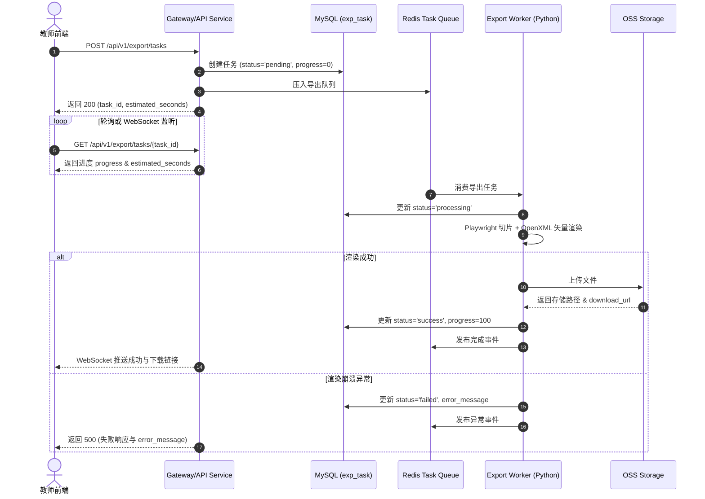

# 多模态 AI 互动式教学智能体系统 - 详细设计说明书

## 3.5 功能模块 5：成果导出中心 (Detailed Design)

### 3.5.1 程序描述
本程序为系统的成果导出中心模块。主要功能是将教师在智能创作工作台中完成的多模态交互式教学方案（包含 PPTX 页面结构、Word 教案文本、音视频素材及 H5 互动组件）精准渲染并转化为符合国家标准规范的静态与动态导出文件（.pptx / .docx / H5 压缩包）。
本模块在系统架构中处于后端交付层，与工作台模块（`ws_project` / `ws_page`）及文件存储模块（`sys_file`）密切配合，通过 Celery 任务队列异步解耦，常驻后台 Worker 进程池，不阻塞主 Web 系统的 HTTP 响应。

---

### 3.5.2 功能
本程序应具有的功能如下，采用 IPO 图/表的形式表达：

#### IPO 图 01：导出配置与任务创建
* **模块号**：EXP-01
* **模块名**：导出配置与任务创建
* **系统/页面**：智能创作工作台 / 成果导出弹窗
* **上级模块**：成果导出中心 (模块5)
* **下级模块**：导出队列调度服务
* **功能**：接收教师提交的导出格式及参数配置，校验项目所有权，预估渲染时间，并在系统数据库注册导出任务后压入异步队列。
* **输入**：`project_id`, `export_type` (`pptx`/`word`/`package`), `config` (包含 `template_id`, `header_footer`, `teacher_notes`, `h5_handling`, `page_range`)
* **输出**：`task_id`, `status` (`pending`), `progress` (0), `estimated_seconds`
* **处理说明**：
  1. 校验当前教师对 `project_id` 的访问与导出权限；
  2. 统计工程页面数 $N_{page}$ 与 H5 组件数 $N_{h5}$，计算预估渲染秒数 $T_{est} = 10 + N_{page} 	imes 2.5 + N_{h5} 	imes 5.0$；
  3. 在 `exp_task` 表插入记录，设置状态为 `pending`；
  4. 将任务 Payload 压入 Redis 优先队列 `export:queue`。
* **数据表**：`exp_task`, `ws_project`, `ws_page`
* **用户响应**：前端弹窗显示预估剩余时间与进度条（0%），提示“导出任务已加入后台队列”。

#### IPO 图 02：PPTX 课件矢量排版与渲染
* **模块号**：EXP-02
* **模块名**：PPTX 课件矢量排版与渲染
* **系统/页面**：后台导出 Worker 引擎
* **上级模块**：成果导出中心 (模块5)
* **下级模块**：无头浏览器渲染服务 (Playwright)
* **功能**：读取页面 JSON 组件树，按 z-index 顺序将其映射解析为原生 PowerPoint 元素（矢量图形、文本框、图形表格），并应用服务器字体嵌入。
* **输入**：`ws_page.components` 组件树 JSON、`.pptx` 样式母版
* **输出**：原生 PowerPoint `.pptx` 内存二进制流
* **处理说明**：
  1. 加载目标母版；
  2. 按 z-index 升序遍历组件；
  3. 计算 Canvas 百分比坐标至 OpenXML `EMU` 换算（$1	ext{ pt} = 12700	ext{ EMU}$）；
  4. 检查服务器预装字体表（`SimSun`, `SimHei`, `Source Han Sans`），启用 Font Fallback Table 降级映射与 `Embed TrueType Fonts`；
  5. 调用 `python-pptx` 接口构建矢量 Shape、表格与文本框。
* **数据表**：`ws_page`
* **用户响应**：后台更新 `exp_task.progress`，推送实时进度至前端。

#### IPO 图 03：Playwright H5 动态组件截图与媒体切片
* **模块号**：EXP-03
* **模块名**：Playwright H5 动态组件截图与媒体切片
* **系统/页面**：后台无头浏览器 Worker
* **上级模块**：成果导出中心 (模块5)
* **下级模块**：外部 Playwright 无头浏览器
* **功能**：针对教学设计中嵌入的交互式 H5 组件，调度无头浏览器进行页面渲染与 300 DPI 矢量切片截图，生成二维码与媒体 Part。
* **输入**：H5 组件入口路径 `h5_entry_path`、分辨率 `1920x1080`、模式 `h5_handling`
* **输出**：高清 PNG Image Part 实体、动态体验二维码
* **处理说明**：
  1. 调度 Playwright 无头浏览器加载目标 H5 路径；
  2. 等待 DOM 与 NetworkIdle 加载完成（超时 30s）；
  3. 截取 300 DPI 矢量 PNG 快照；
  4. 生成 H5 在线体验二维码矢量图并叠加；
  5. 将生成的 Image Part 插入 PPTX 对应 Slide 布局中。
* **数据表**：无
* **用户响应**：后台同步渲染进度。

#### IPO 图 04：Word 教学设计案格式渲染
* **模块号**：EXP-04
* **模块名**：Word 教学设计案格式渲染
* **系统/页面**：后台导出 Worker 引擎
* **上级模块**：成果导出中心 (模块5)
* **下级模块**：无
* **功能**：将教学大纲、教学目标、CoT 思维链对话记录及教学活动表格按国家标准教案格式渲染生成 Word 文档。
* **输入**：教学大纲、教学目标、CoT 对话记录、教案样式 `.dotx` 模板
* **输出**：符合国标的 `.docx` 教案文件实体
* **处理说明**：
  1. 加载国标教案 Word `.dotx` 模板；
  2. 设置全文字体为宋体/黑体，1.5 倍行距；
  3. 自动生成多列教学过程表格，计算单元格跨行合并与边框粗细；
  4. 渲染 CoT 教学提示词框与教师备课注解；
  5. 导出标准的 `.docx` 格式文档。
* **数据表**：`ws_project`
* **用户响应**：后台更新导出进度。

#### IPO 图 05：导出封包、合规校验与签名 URL 生成
* **模块号**：EXP-05
* **模块名**：导出封包、合规校验与签名 URL 生成
* **系统/页面**：后端 Gateway / 文件服务
* **上级模块**：成果导出中心 (模块5)
* **下级模块**：阿里云 OSS 文件服务
* **功能**：对生成的文档进行合规校验，进行打包压缩，上传至云端 OSS，生成带 24h 签名的防盗链下载链接。
* **输入**：渲染生成的 `.pptx` / `.docx` 字节流、`task_id`
* **输出**：`sys_file` 记录、`download_url` (带 24h 签名)、`quality_report`
* **处理说明**：
  1. 校验生成文件的 OpenXML 结构完整性并计算 SHA256 Hash；
  2. 若为混合导出，打包封包为 `.zip` 压缩包；
  3. 上传二进制文件至阿里云 OSS `edu-agent-exports/`；
  4. 生成带 HMAC 鉴权签名的防盗链下载 URL；
  5. 更新 `exp_task` 记录（`status = 'success'`, `progress = 100`）；
  6. 向 Redis 发布 WebSocket 成功推送。
* **数据表**：`exp_task`, `sys_file`
* **用户响应**：前端显示绿色导出成功，提供“立即下载”按钮。

---

### 3.5.3 性能
1. **响应时间**：
   * 导出任务创建接口响应时间 $\le 300	ext{ ms}$。
   * 单页 PPTX 页面渲染耗时 $1 \sim 3	ext{ 秒/页}$。
   * 完整课件包（15-20页PPTX + Word教案）总导出耗时 $1 \sim 3	ext{ 分钟}$（由 PPTX 渲染 30s + Word 排版 20s + 媒体切片 15s + OSS 上传 10s = 75s，叠加高峰期排队余量得出）。
   * 异步进度更新延迟 $\le 500	ext{ ms}$。
2. **并发度**：单个 Worker 节点同时并发处理 20 个导出任务，后台队列支持 1000+ 任务排队。
3. **容量与大小**：导出的单个文件大小上限不超过 $500	ext{ MB}$。

---

### 3.5.4 输入项
* **`user_id`**：INT，当前教师的用户 ID，必填。
* **`project_id`**：INT，目标教学设计工程 ID，必填。
* **`export_type`**：VARCHAR(20)，导出目标格式，有效范围：`pptx` | `word` | `package`。
* **`config`**：JSON，导出配置项：
  * `template_id` (INT)：模板 ID。
  * `header_footer` (OBJECT)：页眉页脚配置。
  * `teacher_notes` (BOOLEAN)：是否包含教师注解。
  * `h5_handling` (VARCHAR)：`embed_qr` | `static_snapshot`。
  * `page_range` (ARRAY)：指定导出页码范围。

---

### 3.5.5 输出项
* **`task_id`**：INT，后端生成的任务唯一标识。
* **`status`**：VARCHAR(20)，任务状态：`pending` | `processing` | `success` | `failed`。
* **`progress`**：INT，当前进度百分比 (0-100)。
* **`estimated_seconds`**：INT，预估剩余渲染秒数，公式：$T_{est} = 10 + N_{page} 	imes 2.5 + N_{h5} 	imes 5.0$。
* **`download_url`**：VARCHAR(500)，带有 HMAC 鉴权签名的防盗链下载 URL (24小时有效)。
* **`quality_report`**：JSON，排版合规与导出质量报告。
* **`error_message`**：VARCHAR(500)，失败时的异常说明。

---

### 3.5.6 算法
1. **OpenXML/PPTX 结构化布局与矢量映射算法**：
   将 Canvas 百分比坐标转化为 OpenXML `EMU`（$1	ext{ pt} = 12700	ext{ EMU}$），按 z-index 建立渲染树。
2. **服务器端字体匹配与 Font Fallback 算法**：
   预置 `SimSun`, `SimHei`, `Source Han Sans` 字体库。若缺少指定字体，依据 Fallback 映射表自动替换，并开启 OpenXML `Embed TrueType Fonts`。
3. **导出耗时预估算法**：
   $T_{est} = 10 + N_{page} 	imes 2.5 + N_{h5} 	imes 5.0$。

---

### 3.5.7 逻辑流程
系统处理流程如下：



---

### 3.5.8 接口

#### 用户接口
说明用户界面提供的操作元素与反馈：
| 接口信息 | 用户输入 | 返回/显示信息 |
| :--- | :--- | :--- |
| 导出格式选择 | 单选框（PPTX / Word / 打包） | 选中状态及对应配置项展示 |
| 导出高级配置 | 模板下拉框、页眉页脚、注解开关 | 实时更新预览示例 |
| 提交导出 | 点击“开始导出”按钮 | 弹出进度条弹窗，显示预估时间与百分比 |
| 导出完成下载 | 点击“立即下载”按钮 | 触发浏览器二进制文件下载 |

#### 外部接口
* **阿里云 OSS 接口**：上传二进制文件，返回物理存储 URL。
* **Playwright 服务接口**：提供无头浏览器截图与 H5 切片服务。

#### 内部接口
内部各微服务元素之间的调用接口表：
| 接口名 | 元素 1 (源) | 元素 2 (目标) | 说明 |
| :--- | :--- | :--- | :--- |
| `POST /api/v1/export/tasks` | Web API Gateway | Task Manager | 创建导出任务，压入队列 |
| `GET /api/v1/export/tasks/{id}` | Web API Gateway | Task Manager | 查询导出进度与状态 |
| `POST /api/v1/export/tasks/{id}/cancel` | Web API Gateway | Celery Worker | 终止正在运行的导出任务 |
| `GET /api/v1/export/preview/{project_id}` | Web API Gateway | Export Engine | 提取预览元数据 |

* **请求/响应示例**：
  * **创建任务成功响应**：
    ```json
    { "code": 200, "message": "success", "data": { "task_id": 8848, "status": "pending", "progress": 0, "estimated_seconds": 45 } }
    ```
  * **任务失败响应**：
    ```json
    { "code": 500, "message": "导出任务执行失败", "data": { "task_id": 8848, "status": "failed", "error_message": "Playwright渲染H5超时" } }
    ```

---

### 3.5.9 存储分配
1. **数据库表**：`exp_task` 表，建组合索引 `idx_user_status (user_id, status)`。
2. **磁盘目录**：物理热存储 `/data/files/export/YYYYMMDD/`，定时任务每 24 小时清理超过 7 天的文件。
3. **字体目录**：`/usr/share/fonts/truetype/custom/`（预装 SimSun.ttf, SimHei.ttf）。

---

### 3.5.10 注释设计
* 模块头标注作者、版本及功能描述。
* 关键 OpenXML 坐标换算必须注释单位公式（`1 pt = 12700 EMU`）。

---

### 3.5.11 限制条件
1. 单个导出任务最大运行时间不得超过 10 分钟。
2. 导出服务器必须预装 `SimSun` 和 `SimHei` 字体库。

---

### 3.5.12 测试计划
1. **测试大纲**：分为单元测试（渲染模块）、集成测试（队列流转）与黑盒压力测试。
2. **测试用例**：
   * **用例 ID 001**：正常导出包含 15 页 Canvas 组件的 PPTX，验证布局无叠影、字体正常。
   * **用例 ID 002**：并发 50 个导出任务，验证 Celery 队列无拥堵，推送无丢失。

---

### 3.5.13 尚未解决的问题
1. 3D Canvas 粒子动画在静态 PPTX 中降级导出为 2D 高清快照的问题，留待下一版本引入 3D Model OpenXML 解决。

---
---

## 3.6 功能模块 6：社区模块（技能与案例广场）(Detailed Design)

### 3.6.1 程序描述
本程序为系统的社区模块（技能与案例广场）。主要功能是为教师提供一个开放共享、资源检索及“一键派生（Derivation）”二次创作的交流平台。教师可在此浏览、搜索优质 Prompt（Skill）及案例，并可将案例完整的快照工程一键复制到自己的工作台中进行个性化修改。
本模块采用 Java Spring Boot 微服务架构，配合 Redis 与 Elasticsearch，提供高并发检索与派生事务处理。

---

### 3.6.2 功能
本程序应具有的功能如下，采用 IPO 图/表的形式表达：

#### IPO 图 01：广场内容多维检索与衰减热度推荐
* **模块号**：COM-01
* **模块名**：广场内容多维检索与衰减热度推荐
* **系统/页面**：社区广场 / 主列表页
* **上级模块**：社区模块 (模块6)
* **下级模块**：Elasticsearch 检索服务
* **功能**：支持按学科、学段、类型筛选内容，并按时间衰减热度公式进行综合推荐排序。
* **输入**：`content_type`, `subject`, `grade`, `sort_by`, `page`, `page_size`
* **输出**：`total`, `items` (包含卡片元数据、不可变版本号 `version` 及统计数)
* **处理说明**：
  1. 过滤只查询 `status = 'published'` 的内容；
  2. 若按热度排序，读取计算衰减得分 $Score = rac{S_{view} 	imes 0.1 + S_{use} 	imes 0.5 + S_{fav} 	imes 2.0 + S_{derive} 	imes 5.0}{(T_{now} - T_{created} + 2)^{1.5}}$；
  3. 查询 Elasticsearch 倒排索引；
  4. 组装作者信息与访问用户的互动状态。
* **数据表**：`com_content`, `sys_user`
* **用户响应**：前端展示网格卡片列表及分页器。

#### IPO 图 02：案例详情查看与 H5 安全沙箱隔离预览
* **模块号**：COM-02
* **模块名**：案例详情查看与 H5 安全沙箱隔离预览
* **系统/页面**：社区广场 / 案例详情弹窗
* **上级模块**：社区模块 (模块6)
* **下级模块**：无
* **功能**：展示案例/Skill 完整大纲，针对内部 H5 组件采用 Safe Iframe 沙箱实现跨域安全隔离预览。
* **输入**：`item_id`, `user_id`
* **输出**：案例详情 JSON、沙箱预览链接
* **处理说明**：
  1. 查询 `com_content` 及其绑定的 `snapshot_project_id`；
  2. Redis Hash 计数器 `view_count` 自增 1；
  3. 针对 H5 组件生成 `https://sandbox.domain.com/preview/{h5_id}` 独立沙箱链接；
  4. 前端通过 `<iframe sandbox="allow-scripts allow-same-origin">` 进行安全隔离渲染。
* **数据表**：`com_content`, `ws_project`
* **用户响应**：前端弹出详情窗口并加载沙箱预览。

#### IPO 图 03：案例工程深拷贝一键派生二次创作
* **模块号**：COM-03
* **模块名**：案例工程深拷贝一键派生二次创作
* **系统/页面**：社区广场 / 派生按钮
* **上级模块**：社区模块 (模块6)
* **下级模块**：智能创作工作台模块
* **功能**：一键将社区公开案例的全部 `ws_project` 与 `ws_page` 深拷贝一份至当前教师的工作台中，建立派生溯源关系。
* **输入**：`item_id` (目标案例ID), `user_id` (派生教师ID)
* **输出**：`new_project_id` (新生成的工程ID)
* **处理说明**：
  1. 验证目标案例状态为 `published`；
  2. 开启数据库事务，深拷贝源 `ws_project` 记录，生成新工程，设置 `parent_project_id = source_project_id`；
  3. 批量深拷贝所有 `ws_page` 页面 JSON，更新组件 UUID；
  4. 写入 `com_interaction` 派生记录；
  5. 源内容 `derivation_count` 自增 1；
  6. 提交事务。
* **数据表**：`com_content`, `com_interaction`, `ws_project`, `ws_page`
* **用户响应**：前端提示“派生成功”，自动跳转至智能工作台开启二次创作。

#### IPO 图 04：创作提交与双重敏感词/AI安全审核
* **模块号**：COM-04
* **模块名**：创作提交与双重敏感词/AI安全审核
* **系统/页面**：智能工作台 / 分享申请
* **上级模块**：社区模块 (模块6)
* **下级模块**：内容安全 API
* **功能**：教师提交个人创作分享申请，系统递增生成不可变版本号（`version+1`），进行敏感词与 Fail-Safe 安全检测。
* **输入**：`project_id`, `title`, `description`, `subject`, `grade`, `tags`
* **输出**：`item_id`, `version`, `status` (`published`/`auditing`)
* **处理说明**：
  1. 计算生成递增版本号 `version = current_max + 1`；
  2. 本地 Trie 树敏感词过滤，命中则抛出 400 阻断；
  3. 异步调用云端内容安全 API；
  4. **Fail-Safe 降级**：若云端 API 超时（>2000ms）或不可用，系统自动设为 `auditing` 转人工审核；通过则设为 `published`；
  5. 在 `adm_audit` 表插入审核记录。
* **数据表**：`com_content`, `adm_audit`
* **用户响应**：前端显示“发布成功”或“已提交管理员审核”。

#### IPO 图 05：社区违规内容举报与审核流转
* **模块号**：COM-05
* **模块名**：社区违规内容举报与审核流转
* **系统/页面**：社区广场 / 举报按钮
* **上级模块**：社区模块 (模块6)
* **下级模块**：后台管理审核模块
* **功能**：教师可对社区违规内容提交举报，系统生成审核工单，并在被高频举报时自动挂起保护。
* **输入**：`item_id`, `reporter_id`, `reason`, `evidence_urls`
* **输出**：`report_id`, `status` (`pending`)
* **处理说明**：
  1. 校验目标内容存在；
  2. 在 `adm_audit` 表插入记录 (`audit_type = 'report'`, `reporter_id = reporter_id`, `status = 'pending'`)；
  3. 向后台管理员发送待审核通知；
  4. 若同一内容被举报超过 5 次，系统自动设置安全锁，临时下架 (`status = 'auditing'`)。
* **数据表**：`adm_audit`, `com_content`
* **用户响应**：前端弹出提示“举报已接收，管理员将尽快处理”。

---

### 3.6.3 性能
1. **响应时间**：列表查询 $\le 200	ext{ ms}$（基于 Redis 缓存），一键派生深拷贝 $\le 1	ext{ 秒}$。
2. **并发度**：广场浏览接口支持 $2000+	ext{ QPS}$。

---

### 3.6.4 输入项
* **`content_type`**：VARCHAR(20)，内容类型：`skill` | `case` | `all`。
* **`subject` & `grade`**：VARCHAR(50)，学科与学段。
* **`item_id`**：INT，目标社区资源 ID。
* **`reason`**：VARCHAR(500)，举报原因说明。

---

### 3.6.5 输出项
* **`items`**：ARRAY，包含 `id`, `title`, `version`, `stats` (查看数/收藏数/派生数/引用数)。
* **`new_project_id`**：INT，派生成功后生成的个人工作台工程 ID。
* **`report_id`**：INT，举报记录 ID。

---

### 3.6.6 算法
1. **衰减热度推荐算法**：
   $$Score = rac{S_{view} 	imes 0.1 + S_{use} 	imes 0.5 + S_{fav} 	imes 2.0 + S_{derive} 	imes 5.0}{(T_{now} - T_{created} + 2)^{1.5}}$$
2. **Fail-Safe 安全降级阻断算法**：
   第三方安全 API 超时（>2000ms）或熔断时，绝不放行上线，自动设为 `auditing` 转人工审核。

---

### 3.6.7 逻辑流程
系统逻辑流程如下：

```mermaid
flowchart TD
    Start([教师进入社区广场]) --> Browse[浏览/搜索案例或Skill]
    Browse --> Select[选择目标案例卡片]
    Select --> ActionChoice{操作选择}
    
    ActionChoice -- 违规举报 --> Report[点击举报按钮]
    Report --> CallReportAPI[POST /items/{id}/report]
    CallReportAPI --> SaveAuditDB[写入 adm_audit 表 (audit_type='report')]
    SaveAuditDB --> ReturnReportSuccess[返回 200 举报已接收]
    
    ActionChoice -- 一键派生二次创作 --> Derive[点击"一键派生"]
    Derive --> CallDeriveAPI[POST /items/{id}/derive]
    CallDeriveAPI --> DB_Trans[开启事务: 深拷贝 ws_project & ws_page]
    DB_Trans --> IncDeriveCount[derivation_count + 1]
    IncDeriveCount --> ReturnProjectID[返回新 project_id 并跳转工作台]
    
    ActionChoice -- 提交发布申请 --> SubmitPublish[POST /items (创建新version)]
    SubmitPublish --> SafeFilter{双重安全过滤}
    SafeFilter -- 命中敏感词 --> RejectDirect[阻断发布 400]
    SafeFilter -- API超时/熔断 --> FallbackAudit[降级转人工审核 auditing]
    SafeFilter -- 安全通过 --> PassAudit[更新 status='published']
```

---

### 3.6.8 接口

#### 用户接口
说明用户界面提供的操作元素与反馈：
| 接口信息 | 用户输入 | 返回/显示信息 |
| :--- | :--- | :--- |
| 广场多维筛选 | 选中学科/学段/排序下拉框 | 刷新列表展示符合条件的卡片 |
| H5 在线预览 | 点击“在线预览” | 弹出安全沙箱 Iframe，展示交互 H5 组件 |
| 一键派生 | 点击“一键派生”按钮 | 提示成功并跳转至工作台编辑页 |
| 违规举报 | 点击“举报”并输入原因 | 弹出提示“举报已接收” |

#### 内部接口
内部各微服务元素之间的调用接口表：
| 接口名 | 元素 1 (源) | 元素 2 (目标) | 说明 |
| :--- | :--- | :--- | :--- |
| `GET /api/v1/community/items` | Web Gateway | Community Service | 分页查询广场列表 |
| `GET /api/v1/community/items/{id}` | Web Gateway | Community Service | 获取社区案例/Skill 详情 |
| `POST /api/v1/community/items/{id}/derive` | Web Gateway | Workspace Service | 一键派生深拷贝案例工程 |
| `POST /api/v1/community/items/{id}/report` | Web Gateway | Audit Service | 提交社区违规内容举报 |
| `POST /api/v1/community/items` | Web Gateway | Audit Service | 提交个人创作发布申请 |

---

### 3.6.9 存储分配
1. **`use_count` 与 `derivation_count` 语义划分**：
   * `use_count`（引用使用数）：轻量参考引用 Skill 或组件。
   * `derivation_count`（派生二次创作数）：完整深拷贝派生全部快照工程。两者独立统计。
2. **核心数据库表**：
   * **`com_content`（社区内容表）**：含 `id`, `content_type`, `author_id`, `title`, `version` (**不可变版本号**), `use_count`, `derivation_count`, `status`。
   * **`com_interaction`（互动行为表）**：含联合唯一索引 `uk_user_target_action (user_id, target_id, target_type, action_type)`。
   * **`adm_audit`（审核与举报记录表）**：含 `audit_type` (`audit`/`report`), `reporter_id`, `reason`, `status` (`pending`/`processed`)。

---

### 3.6.10 注释设计
* 快照派生函数标注 `@Transactional(isolation = Isolation.READ_COMMITTED)` 事务隔离注解。

---

### 3.6.11 限制条件
1. 已发布的内容版本（`version=1`）静态不可变，更新发布生成 `version+1`。
2. 预览 H5 组件必须限制在 `<iframe sandbox="allow-scripts allow-same-origin">` 独立沙箱中。

---

### 3.6.12 测试计划
1. **测试大纲**：分为单元测试（派生事务）、集成测试（举报流转）与黑盒功能测试。
2. **测试用例**：
   * **用例 ID 001**：测试深拷贝派生包含 20 页复杂组件的项目，校验派生后新工程组件数与页面顺序 100% 一致。
   * **用例 ID 002**：测试违规举报提交，验证 `adm_audit` 表正确写入 `reporter_id` 且状态为 `pending`。

---

### 3.6.13 尚未解决的问题
1. 跨版本大更新时派生工程组件 Schema 自动迁移兼容机制留待下一版本实现。
