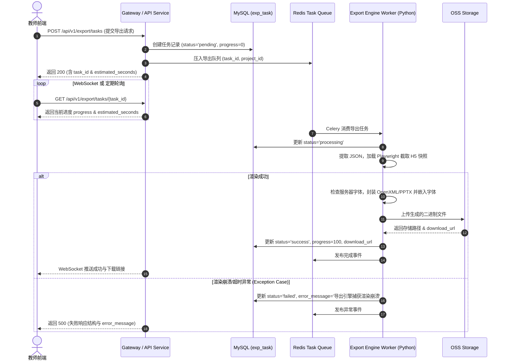

# 多模态 AI 互动式教学智能体系统 - 详细设计说明书

## 3.5 功能模块 5：成果导出中心 (Detailed Design)

### 3.5.1 程序描述
* **模块定位与目标**：成果导出中心是系统的后端高保真交付引擎，负责将教师在智能创作工作台中完成的交互式多模态教学方案（含 PPT 结构图文、 Word 教案文本、音视频素材及 H5 互动组件）精准转化为符合国家标准规范的静态与动态文件。
* **服务架构与技术栈**：导出引擎采用 **Python-FastAPI + Celery + Playwright** 服务架构。
* **主要功能**：支持一键渲染并下载 `.pptx` 课件、`.docx` 教学设计案、H5 互动展示包以及混合资源打包。
* **驻留与执行机制**：采用“前端异步触发 + 后端 Celery 任务队列异步渲染 + 持久化存储 + WebSocket 消息推送”机制。导出服务常驻后台 Worker 进程池，不阻塞主系统 HTTP 响应。

---

### 3.5.2 功能
* **模块功能清单**：
  1. **多格式导出配置**：支持选择导出目标格式（PPTX、Word 教案、H5 包、混合压缩包），支持设置样式模板、页眉页脚、教师注解显示开关、导出页码范围。
  2. **异步导出任务调度**：生成全局唯一导出任务 `task_id`，加入 Redis 优先队列，支持实时进度查询与取消。
  3. **高保真排版与渲染**：
     * **PPTX 导出**：将前端 Canvas 结构化组件映射为原生 PowerPoint 元素（文本框、矢量形状、图形表格、嵌入式图片/音视频），确保矢量可编辑。
     * **Word 教案导出**：将教学设计大纲、CoT 逻辑链、教学目标与活动表按国标教案格式（宋体/黑体、标准行距、表格边框）渲染为标准的 `.docx` 文档。
  4. **导出预览与结果校验**：完成渲染后进行文件完整性校验与格式合规性检查，自动生成防盗链临时下载 URL（有效期 24 小时）。

* **IPO 图 (Input-Process-Output)**：
  ```
  +-----------------------------------+     +----------------------------------------+     +----------------------------------+
  |             输入 (Input)           |     |              处理 (Process)            |     |            输出 (Output)         |
  +-----------------------------------+     +----------------------------------------+     +----------------------------------+
  | 1. 项目ID (project_id)            | --> | 1. 鉴权与项目快照提取                 | --> | 1. 导出任务实体 (exp_task)       |
  | 2. 导出类型 (export_type)         |     | 2. JSON到OpenXML/PPTX结构化转换映射     |     | 2. 任务状态、进度(%)及预估秒数   |
  | 3. 配置项JSON (config):            |     | 3. Playwright 页面/H5矢量切片          |     | 3. 结果文件 (sys_file)           |
  |    - template_id, header_footer  |     | 4. 国标排版与服务器字体嵌入校验        |     | 4. 24h带签名下载链接 (download_url)|
  |    - teacher_notes, page_range   |     | 5. 文件封包、Hash校验与OSS异步上传     |     | 5. 失败时的错误信息 (error_message)|
  +-----------------------------------+     +----------------------------------------+     +----------------------------------+
  ```

---

### 3.5.3 性能
* **响应时间指标**：
  * **导出任务创建接口响应时间**：$\le 300	ext{ ms}$。
  * **单页 PPTX 页面渲染耗时**：$1 \sim 3	ext{ 秒/页}$。
  * **完整课件包（15-20页PPTX + Word教案）总导出耗时**：$1 \sim 3	ext{ 分钟}$。
    * *余量计算逻辑公式*：渲染总耗时由 4 部分叠加组成：
      $$T_{total} = T_{pptx\_render}(15 	ext{页} 	imes 2	ext{s} = 30	ext{s}) + T_{word\_doc}(20	ext{s}) + T_{media\_slice}(15	ext{s}) + T_{oss\_upload}(10	ext{s}) = 75	ext{s}$$
      考虑到高高峰期 Celery 队列排队及网络抖动（约 15-60s 缓冲余量），因此总耗时评估在 1~3 分钟属于合理设计区间。
  * **异步进度更新延迟**：$\le 500	ext{ ms}$。
* **并发吞吐能力**：单个导出 Worker 节点支持同时并发处理 20 个导出任务，后台队列支持 1000+ 任务排队。
* **文件存储粒度**：生成的导出的单个 PPTX/DOCX 文件大小上限不超过 $500	ext{ MB}$。

---

### 3.5.4 输入项
* **入口参数与依赖数据**：
  * `user_id` (INT)：当前操作教师的用户 ID。
  * `project_id` (INT)：工作台中的目标教学设计项目 ID。
  * `export_type` (VARCHAR(20))：导出目标类型，可选值：`pptx` | `word` | `package`。
  * `config` (JSON)：导出参数配置对象，包含：
    * `template_id` (INT)：排版样式模板 ID。
    * `header_footer` (OBJECT)：页眉页脚文本及格式。
    * `teacher_notes` (BOOLEAN)：是否保留教师备注与 CoT 教学提示。
    * `h5_handling` (VARCHAR(20))：H5 互动组件处理策略（`embed_qr` 嵌入二维码 / `static_snapshot` 截取静态图）。
    * `page_range` (ARRAY)：导出页面序号列表，为空表示导出全部。

---

### 3.5.5 输出项
* **导出产出与出口参数**：
  * **响应数据对象**：
    * `task_id` (INT)：后端创建的导出任务唯一标识。
    * `status` (VARCHAR(20))：任务状态（`pending` | `processing` | `success` | `failed`）。
    * `progress` (INT)：当前完成百分比 (0-100)。
    * `estimated_seconds` (INT)：**动态预估剩余渲染时间（秒）**。
      * *计算逻辑*：后端基于 `project_id` 包含的页面总数 $N_{page}$ 和 H5 组件数 $N_{h5}$ 实时计算：
        $$T_{est} = 	ext{BaseTime}(10) + N_{page} 	imes 2.5 + N_{h5} 	imes 5.0$$
    * `download_url` (VARCHAR(500))：带安全签名的下载 URL（仅在状态为 `success` 时有效）。
    * `quality_report` (JSON)：排版合规检查与格式导出结果报告。
    * `error_message` (VARCHAR(500))：若 `status='failed'`，返回标准化错误描述。
  * **物理存储实体**：存储于服务器 `/data/files/export/` 或云端 OSS 中的文件实体，且在数据库 `sys_file` 表中注册记录。

---

### 3.5.6 算法
1. **结构化 JSON 至 OpenXML/PPTX 元素映射与字体嵌入算法**：
   * **输入**：`ws_page.components` 树状 JSON。
   * **算法步骤与字体降级策略**：
     1. 读取目标 PPTX 模板。
     2. **字体库依赖与降级映射（Font Fallback）**：导出服务器预置中文字体表（`SimSun`, `SimHei`, `KaiTi`, `Source Han Sans`）。渲染时优先读取样式指定的字体，若缺失则依据 Font Fallback Table 降级映射为 `SimSun` 或 `Source Han Sans`，避免格式偏移。在 `python-pptx` 保存时启用 `Embed TrueType Fonts` 选项。
     3. 坐标与尺寸映射：将 Canvas 百分比坐标换算为 OpenXML 的 `EMU`（$1	ext{ pt} = 12700	ext{ EMU}$）。
     4. 若组件为 H5/动态互动：调度 **Playwright Headless Browser** 异步渲染页面（指定 Viewport `1920x1080`），截取 300 DPI 矢量/PNG 快照插入。
     5. 保存生成文档并计算 SHA256 校验和。

2. **导出队列滑动窗口与状态回调算法**：
   * 采用 Redis 维护任务优先队列 `export:queue:high` 与 `export:queue:normal`。每完成一个页面的渲染，Worker 向 Redis 发布 `export:progress:<task_id>` 订阅消息，推动 WebSocket 客户端实时同步进度条。

---

### 3.5.7 逻辑流程
* **详细逻辑流程图 (Mermaid)**：



---

### 3.5.8 接口

#### 3.5.8.1 用户接口 (人机界面 / UI交互设计)
1. **导出弹窗面板**：
   * 包含导出格式切换 Radio Button（PPTX 课件 / Word 教案 / 压缩包）。
   * 包含导出高级配置项：样式模板下拉框、是否导出教师注解 Checkbox、H5 组件导出模式选择框。
2. **下载进度条弹窗**：
   * 动态呈现百分比进度条、预估剩余秒数（`estimated_seconds`）与状态提示。
   * 具备“后台运行”与“取消导出”按钮。

#### 3.5.8.2 外部接口
* **OSS 云存储 API**：向阿里云 OSS 上传文件，返回物理 URL。
* **Playwright 微服务 API**：提供 Playwright 无头浏览器截图及 PDF 预览转换服务。

#### 3.5.8.3 内部接口

##### 1. 创建导出任务
* **接口路径**：`POST /api/v1/export/tasks`
* **请求 Header**：`Authorization: Bearer <Token>`
* **请求体 (Request Body)**：
  ```json
  {
    "project_id": 1024,
    "export_type": "pptx",
    "config": {
      "template_id": 3,
      "header_footer": {
        "header_text": "高中物理人教版 - 动量守恒定律",
        "show_page_number": true
      },
      "teacher_notes": true,
      "h5_handling": "embed_qr",
      "page_range": [1, 2, 3, 4, 5]
    }
  }
  ```
* **成功响应体 (Success Response)**：
  ```json
  {
    "code": 200,
    "message": "导出任务创建成功，已加入队列",
    "data": {
      "task_id": 8848,
      "status": "pending",
      "progress": 0,
      "estimated_seconds": 45,
      "created_at": 1721800000.0
    }
  }
  ```

##### 2. 查询导出任务状态与进度
* **接口路径**：`GET /api/v1/export/tasks/{task_id}`
* **成功响应体 (Success Response)**：
  ```json
  {
    "code": 200,
    "message": "success",
    "data": {
      "task_id": 8848,
      "project_id": 1024,
      "export_type": "pptx",
      "status": "success",
      "progress": 100,
      "estimated_seconds": 0,
      "download_url": "https://oss.domain.com/exports/20260724/task_8848.pptx?sign=abc123xyz&expires=1721886400",
      "file_info": {
        "file_name": "动量守恒定律_交互式课件.pptx",
        "file_size": 24589102,
        "mime_type": "application/vnd.openxmlformats-officedocument.presentationml.presentation"
      },
      "finished_at": 1721800042.5
    }
  }
  ```
* **失败响应体 (Error Response Example)**：
  ```json
  {
    "code": 500,
    "message": "导出任务执行失败",
    "data": {
      "task_id": 8848,
      "status": "failed",
      "progress": 45,
      "estimated_seconds": 0,
      "download_url": null,
      "error_message": "Playwright截取H5组件第3页超时，引擎终止处理"
    },
    "error_details": "TimeoutError: Page.screenshot timed out after 30000ms"
  }
  ```

##### 3. 取消导出任务
* **接口路径**：`POST /api/v1/export/tasks/{task_id}/cancel`
* **成功响应体**：
  ```json
  {
    "code": 200,
    "message": "导出任务已终止",
    "data": { "task_id": 8848, "status": "failed" }
  }
  ```

---

### 3.5.9 存储分配

#### 1. 核心表：`exp_task`（成果导出任务表）
| 字段名 | 数据类型 | 允许空 | 默认值 | 说明 |
| :--- | :--- | :--- | :--- | :--- |
| `id` | INT(11) | NO | AUTO_INCREMENT | 主键，导出任务 ID |
| `user_id` | INT(11) | NO | NULL | 外键，关联 `sys_user.id` |
| `project_id` | INT(11) | NO | NULL | 外键，关联 `ws_project.id` |
| `export_type` | VARCHAR(20) | NO | 'pptx' | 导出类型（`pptx`/`word`/`package`） |
| `config` | JSON | YES | NULL | 导出参数 JSON |
| `status` | VARCHAR(20) | NO | 'pending' | 任务状态（`pending`/`processing`/`success`/`failed`） |
| `progress` | INT(11) | NO | 0 | 当前进度 (0-100) |
| `result_file_id` | BIGINT(20) | YES | NULL | 关联文件 ID（`sys_file.id`） |
| `download_url` | VARCHAR(500) | YES | NULL | 签名下载 URL |
| `quality_report` | JSON | YES | NULL | 排版检查结果报告 |
| `error_message` | VARCHAR(500) | YES | NULL | 失败时的标准化异常描述 |
| `created_at` | FLOAT | NO | NULL | 创建 Unix 时间戳 |
| `finished_at` | FLOAT | YES | NULL | 完成 Unix 时间戳 |

#### 2. 物理存储与清理策略
* **数据库索引**：在 `exp_task` 上建组合索引 `idx_user_status (user_id, status)`。
* **字体库预装清单**：`/usr/share/fonts/truetype/custom/`（包含 SimSun.ttf, SimHei.ttf, SourceHanSansSC-Regular.otf）。
* **清理脚本**：定时任务每 24 小时自动清理 `/data/files/export/` 中超过 7 天的物理文件。

---

### 3.5.10 注释设计
* 代码 Docstring 必须规范描述参数类型与返回值。OpenXML 转换函数需显式注释单位计算公式（`1 pt = 12700 EMU`）。

---

### 3.5.11 限制条件
1. **任务运行超时限制**：单个导出任务最大运行时间不得超过 $600	ext{ 秒}$ (10 分钟)。
2. **服务器字体依赖限制**：导出 Worker 镜像必须预装中文字体库（SimSun, SimHei），未预装将触发容器启动自检报警。

---

### 3.5.12 测试计划
* **单元测试**：验证各类组件转化为 `.pptx` 后排版不重叠。
* **性能测试**：使用 JMeter 模拟 50 个并发导出请求，验证 Celery 任务队列吞吐平稳。

---

### 3.5.13 尚未解决的问题
1. **复杂 Canvas 粒子动画在静态 PPTX 中的保真度损失**：未来计划引入 3D Model OpenXML 扩展支持。

---
---

## 3.6 功能模块 6：社区模块（技能与案例广场）(Detailed Design)

### 3.6.1 程序描述
* **模块定位与目标**：社区模块（技能与案例广场）是整个互动式教学智能体平台的开放共享与二次创作中心。教师可在广场中浏览、检索、使用他人分享的优质教学 Prompt（Skill 智能体技能模板）及高质教学设计工程案例，并可“一键派生（Derivation）”至个人工作台进行二次创作。
* **技术栈与架构**：采用 **Java / Spring Boot + Redis + Elasticsearch** 服务架构。

---

### 3.6.2 功能
* **模块功能清单**：
  1. **广场内容浏览与多维检索**：支持按内容类型（Skill 技能 / 教学案例）、学科、学段、热度/时间/派生量进行筛选与搜索。
  2. **详情查看与安全交互预览**：提供案例与 Skill 详情展示。针对案例中包含的 H5 互动组件，采用**安全沙箱（Safe Iframe Sandbox）**进行在线隔离预览。
  3. **一键派生与二次创作 (Derivation)**：教师可一键派生深拷贝一份完整的项目快照至个人工作台，建立衍生溯源关系。
  4. **违规内容举报功能**：教师在浏览社区内容时，若发现政治违禁、侵权或不良信息，可提交违规举报。
  5. **版本迭代与发布管理**：采用“**不可变快照版本 (Immutable Versioned Snapshot)**”策略，发布内容 `version` 不可覆盖历史版本，更新发布将生成 `version+1` 增量新快照。

* **IPO 图 (Input-Process-Output)**：
  ```
  +-----------------------------------+     +----------------------------------------+     +----------------------------------+
  |             输入 (Input)           |     |              处理 (Process)            |     |            输出 (Output)         |
  +-----------------------------------+     +----------------------------------------+     +----------------------------------+
  | 1. 查询条件 (subject, grade,      | --> | 1. 审核状态过滤 (status='published')    | --> | 1. 广场内容分页列表 (com_content) |
  |    content_type, keyword, sort)   |     | 2. 热度与时间衰减综合推荐排序计算      |     | 2. 案例快照实体与安全 Iframe 预览 |
  | 2. 派生动作 (item_id)             |     | 3. 快照项目深拷贝与派生溯源链路建立    |     | 3. 新派生创建的项目ID (project_id)|
  | 3. 举报信息 (item_id, reason,     |     | 4. 双重敏感词与 AI 安全过滤及降级阻断 |     | 4. 举报处理记录 (adm_audit)      |
  |    evidence_urls)                 |     | 5. 交互防重控制与统计计数器自增        |     | 5. 操作成功/失败响应 (code)       |
  +-----------------------------------+     +----------------------------------------+     +----------------------------------+
  ```

---

### 3.6.3 性能
* **响应时间指标**：
  * **广场列表查询与分页响应时间**：$\le 200	ext{ ms}$（基于 Redis 缓存）。
  * **一键派生（快照项目复制）耗时**：$\le 1	ext{ 秒}$。
* **并发吞吐能力**：广场浏览查询接口支持 $2000+	ext{ QPS}$。

---

### 3.6.4 输入项
* **入口参数与依赖数据**：
  * **列表查询参数**：`content_type`, `subject`, `grade`, `sort_by`, `page`, `page_size`。
  * **派生输入参数**：`item_id` (INT), `target_folder_id` (INT)。
  * **举报提交参数**：`item_id` (INT), `reason` (VARCHAR), `evidence_urls` (ARRAY)。

---

### 3.6.5 输出项
* **产出数据与出口参数**：
  * **社区内容对象列表 (`items`)**：包含 `id`, `title`, `content_type`, `version`, `stats` (查看数/收藏数/派生数/引用数)。
  * **派生创建结果**：返回新生成的个人项目 ID `new_project_id`。
  * **举报处理结果**：返回 `report_id` 及 `status = 'pending'`。

---

### 3.6.6 算法
1. **广场综合热度衰减推荐排序算法**：
   * **热度得分公式**：
     $$Score = rac{S_{view} 	imes 0.1 + S_{use} 	imes 0.5 + S_{fav} 	imes 2.0 + S_{derive} 	imes 5.0}{(T_{now} - T_{created} + 2)^{1.5}}$$
   * 定时任务每 15 分钟更新 Redis ZSet 索引 `community:rank:<content_type>`。

2. **案例项目深拷贝与快照派生溯源算法**：
   * 开启数据库事务，深拷贝源项目 `ws_project` 及其关联的所有 `ws_page` JSON，生成新 `project_id`，设置 `parent_project_id`。派生成功后，自增 `derivation_count`。

3. **双重安全过滤与降级阻断算法 (Fail-Safe Algorithm)**：
   * **处理步骤**：
     1. 本地轻量级 Trie 树敏感词匹配（耗时 $< 5	ext{ms}$），若命中直接阻断抛出错误。
     2. 异步调用第三方云端内容安全 API。
     3. **降级策略 (Fail-Safe)**：若第三方 API 响应超时（$> 2000	ext{ms}$）或服务熔断，系统**绝不放行直接上线**，而是自动将内容状态设为 `auditing`（进入人工审核队列），同时返回 500 错误警告提示“内容安全服务繁忙，已转入人工审核”。

---

### 3.6.7 逻辑流程
* **详细逻辑流程图 (Mermaid)**：

```mermaid
flowchart TD
    Start([教师进入社区广场]) --> Browse[浏览/搜索案例或Skill]
    Browse --> Select[选择目标案例卡片]
    Select --> ActionChoice{操作选择}
    
    ActionChoice -- 违规举报 --> Report[点击举报按钮]
    Report --> CallReportAPI[POST /items/{id}/report]
    CallReportAPI --> SaveAuditDB[写入 adm_audit 表 (audit_type='report')]
    SaveAuditDB --> ReturnReportSuccess[返回 200 举报已接收]
    
    ActionChoice -- 一键派生二次创作 --> Derive[点击"一键派生"]
    Derive --> CallDeriveAPI[POST /items/{id}/derive]
    CallDeriveAPI --> DB_Trans[开启事务: 深拷贝 ws_project & ws_page]
    DB_Trans --> IncDeriveCount[derivation_count + 1]
    IncDeriveCount --> ReturnProjectID[返回新 project_id 并跳转工作台]
    
    ActionChoice -- 提交发布申请 --> SubmitPublish[POST /items (创建新version)]
    SubmitPublish --> SafeFilter{双重安全过滤}
    SafeFilter -- 命中敏感词 --> RejectDirect[阻断发布 400]
    SafeFilter -- API超时/熔断 --> FallbackAudit[降级转人工审核 auditing]
    SafeFilter -- 安全通过 --> PassAudit[更新 status='published']
```

---

### 3.6.8 接口

#### 3.6.8.1 用户接口 (人机界面 / UI交互与 H5 安全沙箱)
1. **广场主界面与卡片 Grid**：展示内容类型、版本 Tag (`v1.0`/`v2.0`)、统计数据、一键派生与举报入口。
2. **H5 在线预览安全沙箱 (Safe Iframe Sandbox)**：
   * 在社区预览案例中的 H5 互动组件时，统一加载在独立安全域名 `https://sandbox.domain.com` 下。
   * Iframe 必须设置安全隔离属性：`<iframe src="..." sandbox="allow-scripts allow-same-origin" referrerpolicy="no-referrer"></iframe>`，禁止预览组件读取主站 Cookie、LocalStorage 或 Token。

#### 3.6.8.2 内部接口

##### 1. 分页查询广场列表
* **接口路径**：`GET /api/v1/community/items`
* **成功响应体**：
  ```json
  {
    "code": 200,
    "message": "success",
    "data": {
      "total": 128,
      "page": 1,
      "page_size": 12,
      "items": [
        {
          "id": 501,
          "content_type": "case",
          "title": "基于CoT思维导图的高中物理《动量守恒定律》探究课",
          "version": 1,
          "subject": "物理",
          "grade": "高中",
          "stats": {
            "view_count": 3420,
            "use_count": 890,
            "favorite_count": 450,
            "derivation_count": 126
          },
          "created_at": 1721750000.0
        }
      ]
    }
  }
  ```

##### 2. 提交违规举报 API
* **接口路径**：`POST /api/v1/community/items/{item_id}/report`
* **请求 Header**：`Authorization: Bearer <Token>`
* **请求体 (Request Body)**：
  ```json
  {
    "reason": "包含政治违禁与不当言论",
    "evidence_urls": ["https://oss.domain.com/evidence/screenshot_1.jpg"]
  }
  ```
* **成功响应体 (Success Response)**：
  ```json
  {
    "code": 200,
    "message": "举报已提交，管理员将尽快审核处理",
    "data": {
      "report_id": 902,
      "item_id": 501,
      "status": "pending",
      "created_at": 1721800500.0
    }
  }
  ```

##### 3. 一键派生 / 二次创作
* **接口路径**：`POST /api/v1/community/items/{item_id}/derive`
* **成功响应体**：
  ```json
  {
    "code": 200,
    "message": "派生成功！已生成新工作台工程",
    "data": {
      "source_item_id": 501,
      "new_project_id": 3096,
      "project_name": "基于CoT思维导图的高中物理《动量守恒定律》探究课 (二次创作)",
      "derived_at": 1721801200.0
    }
  }
  ```

---

### 3.6.9 存储分配

#### 1. `use_count` 与 `derivation_count` 业务语义边界划分说明
* **`use_count` (引用使用次数)**：指教师在编写教案或创作其他项目时，仅仅**轻量引用/调用**了该 Skill 技能 Prompt 或该案例的某个特定组件/素材作为参考。
* **`derivation_count` (派生二次创作次数)**：指教师**完整克隆派生**了该案例/Skill 的全部快照工程，并在此基础上生成新的关联项目。
* **划分规则**：派生操作只增加 `derivation_count`，**不计入** `use_count`，两者独立统计，确保数据语义清晰。

#### 2. 核心表 1：`com_content`（社区内容表）
| 字段名 | 数据类型 | 允许空 | 默认值 | 说明 |
| :--- | :--- | :--- | :--- | :--- |
| `id` | INT(11) | NO | AUTO_INCREMENT | 主键，社区内容 ID |
| `content_type` | VARCHAR(20) | NO | 'case' | 类型（`skill` / `case`） |
| `author_id` | INT(11) | NO | NULL | 发布教师 ID (`sys_user.id`) |
| `title` | VARCHAR(200) | NO | NULL | 内容标题 |
| `description` | VARCHAR(500) | YES | NULL | 内容描述 |
| `subject` | VARCHAR(50) | YES | NULL | 分类学科 |
| `grade` | VARCHAR(50) | YES | NULL | 分类学段 |
| `version` | INT(11) | NO | 1 | **不可变快照版本号** |
| `snapshot_project_id`| INT(11) | YES | NULL | 关联引用的项目快照 ID |
| `status` | VARCHAR(20) | NO | 'draft' | 状态（`draft`/`auditing`/`published`/`rejected`） |
| `view_count` | INT(11) | NO | 0 | 浏览次数 |
| `use_count` | INT(11) | NO | 0 | **引用使用次数（轻量参考引用）** |
| `favorite_count` | INT(11) | NO | 0 | 收藏次数 |
| `derivation_count` | INT(11) | NO | 0 | **派生二次创作次数（完整克隆派生）** |
| `created_at` | FLOAT | NO | NULL | 发布时间戳 |

#### 3. 核心表 2：`com_interaction`（社区互动行为表）
* 包含联合唯一索引 `uk_user_target_action (user_id, target_id, target_type, action_type)`，防重复收藏。

#### 4. 核心表 3：`adm_audit`（审核与举报记录表）
| 字段名 | 数据类型 | 允许空 | 默认值 | 说明 |
| :--- | :--- | :--- | :--- | :--- |
| `id` | INT(11) | NO | AUTO_INCREMENT | 主键，记录 ID |
| `audit_type` | VARCHAR(20) | NO | 'audit' | 类型（`audit`发布审核 / `report`举报处理）|
| `target_type` | VARCHAR(20) | NO | 'case' | 目标类型（`skill`/`case`） |
| `target_id` | INT(11) | NO | NULL | 目标内容 ID (`com_content.id`) |
| `reporter_id` | INT(11) | YES | NULL | **举报人 ID（发布审核时为空，举报时填入）** |
| `reason` | VARCHAR(500) | YES | NULL | 举报原因或申请备注 |
| `handler_id` | INT(11) | YES | NULL | 处理管理员 ID |
| `action` | VARCHAR(20) | YES | NULL | 处理动作（`approve`/`reject`/`offline`）|
| `status` | VARCHAR(20) | NO | 'pending' | 状态（`pending`/`processed`/`ignored`）|
| `created_at` | FLOAT | NO | NULL | 提交时间戳 |

---

### 3.6.10 注释设计
* 快照派生函数（`derive_project_snapshot`）必须标注 `@Transactional(isolation = Isolation.READ_COMMITTED)` 事务隔离注解。

---

### 3.6.11 限制条件
1. **已发布快照版本不可变策略 (Immutable Version Strategy)**：已上线广场的内容版本（如 `version=1`）禁止原地覆写修改；原作者若更新需提交新版本发布申请（`version=2`），旧版本保持已派生链的数据一致性。
2. **H5 安全沙箱隔离限制**：预览 H5 组件必须限制在 `<iframe sandbox="allow-scripts allow-same-origin">` 独立子域名容器中。

---

### 3.6.12 测试计划
* 单元测试 + 敏感词拦截测试 + 举报流转集成测试。

---

### 3.6.13 尚未解决的问题
1. **跨版本大更新时派生组件向前兼容**：未来计划引入自动组件 Schema 迁移工具。
